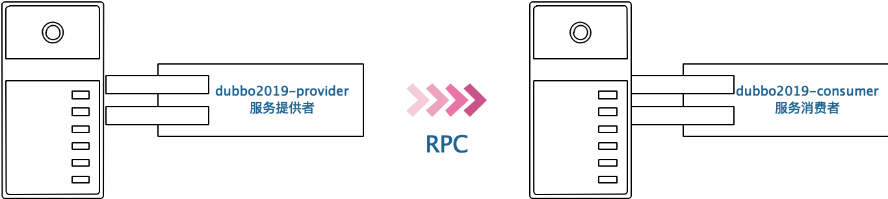
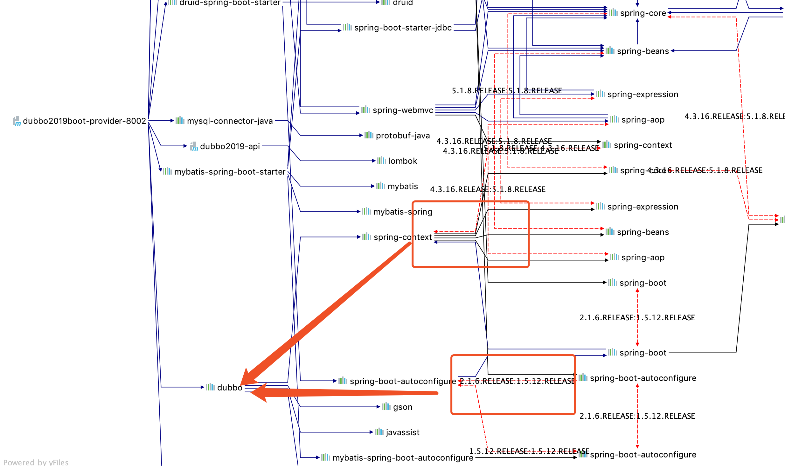
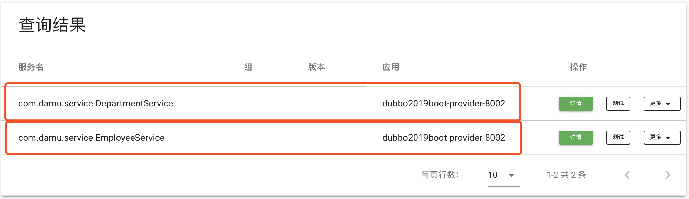
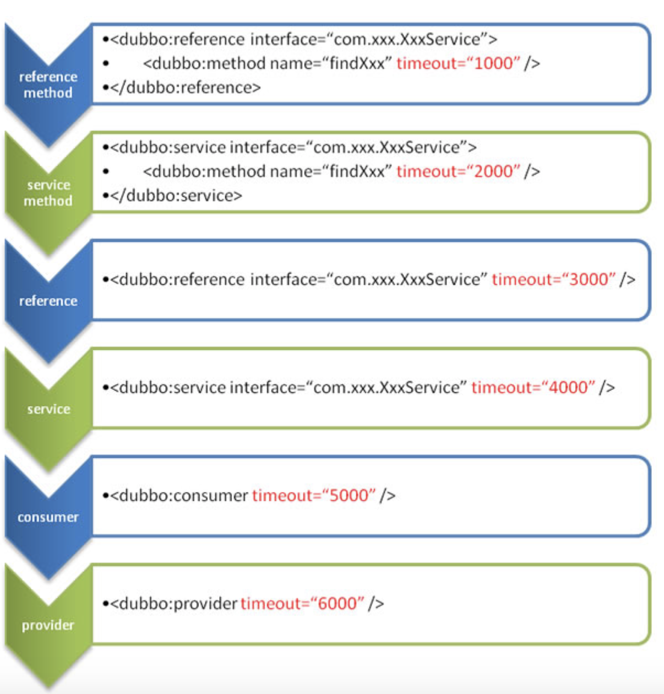

[TOC]

# 一、 Dubbo 概述

`Dubbo`是一个`RPC`框架，是一套分布式系统架构的解决方案。

## 1、 什么是分布式系统

分布式系统（`Distributed System`）是建立在网络上的若干个独立计算机服务的集合，每个计算机服务对于用户而言都是一个独立的计算机服务。


## 2、 软件结构演变历程

### （1）  单一应用架构

软件的整体架构模式为单体架构模式，单机部署的方式实现的软件应用模式。

该模式下软件中所有功能集中开发和部署，如下图所示：


| 优点           | 需要补充              |
| -------------- | --------------------- |
| 开发技术栈简单 | 多人协同困难          |
| 功能稳定       | 功能扩展困难          |
| 性能稳定       | 性能提升 垂直扩展有限 |


### （2）  垂直应用架构

软件使用垂直架构模式，集群不是的方式实现的软件应用模式。  


| 优点                 | 需要补充               |
| -------------------- | ---------------------- |
| 多人协同开发容易     | 模块之间互相调用不便   |
| 功能扩展方便         | 功能维护难度较高       |
| 模块化划分责任明确   | 上下层代码之间耦合度高 |
| 单体业务性能扩展方便 |                        |

### （3） 前后端分离架构

软件架构时将前端交互部分独立出来作为独立的项目进行开发，和服务端程序进行解耦合操作，在垂直架构的模式上扩展实现。


| 优点                 | 需要补充         |
| -------------------- | ---------------- |
| 多人协同方便         | 远程调用困难     |
| 前后端业务解耦合     | 前端技术难度提升 |
| 服务扩展功能更加方便 | 服务粒度不好控制 |
| 单体业务性能扩展方便 |                  |


### （4）  分布式架构

软件在垂直应用和前后端分离架构的基础上，将软件的后端业务受理服务进行细粒度拆分，服务之间解耦合完成高可用部署。


### （5） 分布式集群架构

在分布式的基础上，水平扩展多态服务器，根据业务的处理压力进行服务器的分配部署和调优。


### （6） 面向服务架构

在分布式集群的基础上，对基础服务进行服务治理，完善服务分配及调用模式，将最优的性能分配到压力最大的服务，支撑软件系统的高可用性。


## 3、 `RPC`远程过程调用

软件开发从垂直架构模式开始，远程调用就变得非常重要，`RPC（remote procedure call）`就是为此而出现的一种编程思想，语序一个服务可以在不知道远程服务底层实现的情况下，请求调用远程服务器暴露的接口获取需要的数据。


处理过程中通信网络和参数的处理过程，直接决定了`RPC`框架的处理效率，市场上目前比较成熟可用的技术选型有很多种

-   `Apache Dubbo`
-   `Google gRPC`
-   `Facebook Thrift`
-   `Alibaba HSF`
-   `more...`


## 4、 `Apache Dubbo`

官方网站：`http://dubbo.apache.org/en-us/`


### （1） `Dubbo`概述

阿里的一个开源框架，在2011年托管`apache`开源发布，但是在2014年停止了更新

2018年1月`Alibaba`将`Dubbo`和`DubboX`合并发布2.6.x版本，并于2月份贡献给`Apache`成为了一个成熟的子项目


`Dubbo`通过`服务治理`的`服务注册中心`，可以将软件服务进行合理的整合和调用，并就所有服务器的处理压力进行负载均衡，在服务处理过程中通过`流量调度`完成灰度发布的实现，同时提供了可视化服务能让项目很友好的使用`Dubbo`完成整体项目的信息监控。

### （2）  `Dubbo`架构

官方提供的`Dubbo`基本架构图，提供了基本的几个构建组件：


架构中的组件：

-   `Container`：服务容器
-   `Provider`：服务提供者
-   `Consumer`：服务消费者
-   `Registry`：注册中心
-   `Monitor`：监控

运行流程：

0.  `Container`容器启动，加载服务提供者`Provider`
1.  将服务提供者注册到注册中心`Registry`
2.  服务消费者从注册中心订阅`(subscribe)`提供者服务`Provider Service`
3.  注册中心`Registry`和消费者`Consumer`之间就服务的变动完成通信
4.  消费者`Consumer`根据注册中心反馈的服务信息调用提供者`Provider`服务
5.  监控中心`Monitor`就服务的提供和调用完成细节的监控处理

### （3） 注册中心

`Dubbo`官方支持多种注册中心服务组件，如`Multicast`、`Zookeeper`、`Nacos`、`Redis`以及自身提供的`Simple`注册中心，但是官方推荐使用`Zookeeper`作为自身的注册中心。

`Zookeeper`的使用方式请参考 [大牧絮叨系列-Zookeeper](https://laomu.github.io/大牧絮叨系列-Zookeeper/Zookeeper%20Tutorial)

### （4） 监控中心

目前的管理控制台已经发布0.1版本，结构上采取了前后端分离的方式，前端使用Vue和Vuetify分别作为Javascript框架和UI框架，后端采用Spring Boot框架。既可以按照标准的Maven方式进行打包，部署，也可以采用前后端分离的部署方式，方便开发，功能上，目前具备了服务查询，服务治理(包括Dubbo2.7中新增的治理规则)以及服务测试三部分内容。【引用官方内容】

（1）  `maven`方式部署安装

```shell
# 通过git方式下载远程仓库项目文件
$ git clone https://github.com/apache/dubbo-admin.git

# 使用`maven`命令进行清理并重新打包
$ cd dubbo-admin
$ mvn clean package

# 运行打包后的jar文件
$ cd dubbo-admin-distribution/target
$ java -jar dubbo-admin-0.1.jar
```


（2） 前后端分离方式安装

前端：

```shell
# 进入下载的源代码-ui文件夹
$ cd dubbo-admin-ui 
# 使用node包管理命令安装前端依赖库文件
$ npm install 
# 启动服务
$ npm run dev 
```

后端：

```shell
# 进入下载的源代码-server目录
$ cd dubbo-admin-server
# 清理并重新打包
$ mvn clean package 
# 运行打包后的jar文件
$ cd target
$ java -jar dubbo-admin-server-0.1.jar
```

（3） 自定义配置

远程下载的监控模块的配置主要包含在`dubbo-admin-server/src/main/resources/application.properties`中，通常获取到本地之后需要修改的核心配置：

```properties
# 配置中心地址
admin.config-center=zookeeper://127.0.0.1:2181
# 注册中心地址
admin.registry.address=zookeeper://127.0.0.1:2181
# 元数据中心地址
admin.metadata-report.address=zookeeper://127.0.0.1:2181
```

（4） 访问测试

分别启动前后端服务应用

```shell
# 启动前端应用
$ cd dubbo-admin-ui
$ npm run dev

# 启动后端应用
$ cd dubbo-admin-server
$ java -jar dubbo-admin-server-0.1.jar
```

打开浏览器访问`http://localhost:8080`


## 5、`Dubbo Xml`实现

首先构建一个基于`Xml`配置方式的`Dubbo`架构的软件应用，快速了解`Dubbo`中的各个功能模块和组件之间的依赖及调用关系。

### （1）  创建`api`模块应用

基于`Dubbo最佳应用实践`的指导，我们将 `数据模型`、`功能接口`等都定义在`api`模块中，方便其他模块的使用。

创建`maven`项目：`dubbo2019-api`

#### a. `pom.xml`添加依赖：

```xml
<?xml version="1.0" encoding="UTF-8"?>
<project xmlns="http://maven.apache.org/POM/4.0.0"
         xmlns:xsi="http://www.w3.org/2001/XMLSchema-instance"
         xsi:schemaLocation="http://maven.apache.org/POM/4.0.0 http://maven.apache.org/xsd/maven-4.0.0.xsd">
    <parent>
        <artifactId>dubbo2019</artifactId>
        <groupId>dubbo2019</groupId>
        <version>1.0-SNAPSHOT</version>
    </parent>
    <modelVersion>4.0.0</modelVersion>
    <artifactId>dubbo2019-api</artifactId>
    <dependencies>
        <dependency>
            <groupId>org.projectlombok</groupId>
            <artifactId>lombok</artifactId>
            <version>1.18.8</version>
        </dependency>
    </dependencies>
</project>
```

#### b. 创建实体处理类

部门类型和职员类型【附录1中提供了测试用数据】，包含在`com.damu.entity`包中：

需要注意~这里定义的数据模型类，因为后续设计到`RPC`调用，所以必须实现序列化接口。

-   `Department.java`
-   `Employee.java`

```java
package com.damu.entity;

import lombok.AllArgsConstructor;
import lombok.Data;
import lombok.NoArgsConstructor;
import lombok.experimental.Accessors;

/**
 * <p>项目文档： 部门数据</p>
 *
 * @author <a href="https://github.com/laomu/laomu.github.io">大牧</a>
 * @version V1.0
 */
@Data
@AllArgsConstructor
@NoArgsConstructor
@Accessors(chain = true)
public class Department implements Serializable {
    private Long        deptNo;     //  部门编号
    private String      deptName;   //  部门名称
    private String      location;   //  部门所在地区
}
```

```java
package com.damu.entity;

import lombok.AllArgsConstructor;
import lombok.Data;
import lombok.NoArgsConstructor;
import lombok.experimental.Accessors;

import java.util.Date;

/**
 * <p>项目文档： 职员数据</p>
 *
 * @author <a href="https://github.com/laomu/laomu.github.io">大牧</a>
 * @version V1.0
 */
@Data
@AllArgsConstructor
@NoArgsConstructor
@Accessors(chain = true)
public class Employee implements Serializable {
    private Long            empNo;      // 职员编号
    private String          empName;    // 职员名称
    private String          nickname;   // 职员昵称
    private String          job;        // 职员岗位
    private Long            mgr;        // 上级编号
    private Date            hirdate;    // 入伙时间
    private Integer         salary;     // 薪水待遇
    private Integer         comm;       // 奖金福利
    private Long            deptNo;     // 所属部分
}
```

#### c. 构建业务受理通用接口

包含在`com.damu.service`包中

-   `IService.java`
-   `DepartmentService.java`
-   `EmployeeService.java`

```java
package com.damu.service;

import java.util.List;

/**
 * <p>项目文档： 通用服务受理接口</p>
 *
 * @author <a href="https://github.com/laomu/laomu.github.io">大牧</a>
 * @version V1.0
 */
public interface IService<T> {

    /**
     * 增加数据
     * @param t 要增加的数据
     * @return 影响的记录数
     */
    Integer add(T t);

    /**
     * 根据编号删除数据
     * @param id 要删除的数据编号
     * @return 影响的记录数
     */
    Integer delete(String id);

    /**
     * 更新数据
     * @param t 要更新的数据
     * @return 影响的记录数
     */
    Integer update(T t);

    /**
     * 查询指定的所有数据
     * @return 数据列表
     */
    List<T> getAll();

    /**
     * 根据编号获取对应数据
     * @param id 数据编号
     * @return 数据
     */
    T getById(String id);
}
```

```java
package com.damu.service;

import com.damu.entity.Department;

/**
 * <p>项目文档： 部门业务受理接口</p>
 *
 * @author <a href="https://github.com/laomu/laomu.github.io">大牧</a>
 * @version V1.0
 */
public interface DepartmentService extends IService<Department>{

}
```

```java
package com.damu.service;

import com.damu.entity.Employee;

/**
 * <p>项目文档： 职员类型业务接口</p>
 *
 * @author <a href="https://github.com/laomu/laomu.github.io">大牧</a>
 * @version V1.0
 */
public interface EmployeeService extends IService<Employee>{

}
```

### （2） 创建服务模块

这里的服务模块是抽象的形式表示项目中的一个`功能提供模块`，在业务受理过程中可能会被其他模块`调用`


#### a. 构建`maven`项目：`dubbo2019-provider-8001`

这一部分我们的技术选型如下：

-   数据库连接池：`druid`[复习、回顾、整理]
-   数据`ORM`：`mybatis xml`[复习、回顾、整理]

修改`pom.xml`添加依赖关系

```xml
<?xml version="1.0" encoding="UTF-8"?>
<project xmlns="http://maven.apache.org/POM/4.0.0"
         xmlns:xsi="http://www.w3.org/2001/XMLSchema-instance"
         xsi:schemaLocation="http://maven.apache.org/POM/4.0.0 http://maven.apache.org/xsd/maven-4.0.0.xsd">
    <parent>
        <artifactId>dubbo2019</artifactId>
        <groupId>dubbo2019</groupId>
        <version>1.0-SNAPSHOT</version>
    </parent>
    <modelVersion>4.0.0</modelVersion>

    <artifactId>dubbo2019-provider-8001</artifactId>

    <dependencies>
        <!-- 基本依赖 -->
        <dependency>
            <groupId>dubbo2019</groupId>
            <artifactId>dubbo2019-api</artifactId>
            <version>1.0-SNAPSHOT</version>
        </dependency>
        <!-- 数据访问依赖 -->
        <dependency>
            <groupId>mysql</groupId>
            <artifactId>mysql-connector-java</artifactId>
            <version>8.0.16</version>
        </dependency>
        <dependency>
            <groupId>org.mybatis</groupId>
            <artifactId>mybatis</artifactId>
            <version>3.5.1</version>
        </dependency>
        <dependency>
            <groupId>com.alibaba</groupId>
            <artifactId>druid</artifactId>
            <version>1.1.18</version>
        </dependency>
        <!-- mybatis-spring适配 -->
        <dependency>
            <groupId>org.mybatis</groupId>
            <artifactId>mybatis-spring</artifactId>
            <version>2.0.2</version>
        </dependency>
        <!-- spring -->
        <dependency>
            <groupId>org.springframework</groupId>
            <artifactId>spring-core</artifactId>
            <version>5.1.8.RELEASE</version>
        </dependency>
        <dependency>
            <groupId>org.springframework</groupId>
            <artifactId>spring-beans</artifactId>
            <version>5.1.8.RELEASE</version>
        </dependency>
        <dependency>
            <groupId>org.springframework</groupId>
            <artifactId>spring-context</artifactId>
            <version>5.1.8.RELEASE</version>
        </dependency>
        <dependency>
            <groupId>org.springframework</groupId>
            <artifactId>spring-jdbc</artifactId>
            <version>5.1.8.RELEASE</version>
        </dependency>
        <dependency>
            <groupId>junit</groupId>
            <artifactId>junit</artifactId>
            <version>4.12</version>
        </dependency>
    </dependencies>
</project>
```


#### b. 构建`mapper`接口

-   `DepartmentMapper.java`
-   `EmployeeMapper.java`

```java
package com.damu.mapper;

import com.damu.entity.Department;
import org.springframework.stereotype.Repository;

import java.util.List;

/**
 * <p>项目文档： 部门关系映射</p>
 *
 * @author <a href="https://github.com/laomu/laomu.github.io">大牧</a>
 * @version V1.0
 */
@Repository
public interface DepartmentMapper {

    /**
     * 增加数据
     * @param department 要增加的数据
     * @return 影响的记录数
     */
    Integer add(Department department);

    /**
     * 根据编号删除数据
     * @param id 要删除的数据编号
     * @return 影响的记录数
     */
    Integer delete(String id);

    /**
     * 更新数据
     * @param department 要更新的数据
     * @return 影响的记录数
     */
    Integer update(Department department);

    /**
     * 查询指定的所有数据
     * @return 数据列表
     */
    List<Department> findAll();

    /**
     * 根据编号获取对应数据
     * @param id 数据编号
     * @return 数据
     */
    Department findById(String id);
}
```

```java
package com.damu.mapper;

import com.damu.entity.Department;
import com.damu.entity.Employee;

import java.util.List;

/**
 * <p>项目文档： 职员关系映射</p>
 *
 * @author <a href="https://github.com/laomu/laomu.github.io">大牧</a>
 * @version V1.0
 */
public interface EmployeeMapper {

    /**
     * 增加数据
     * @param employee 要增加的数据
     * @return 影响的记录数
     */
    Integer add(Employee employee);

    /**
     * 根据编号删除数据
     * @param id 要删除的数据编号
     * @return 影响的记录数
     */
    Integer delete(String id);

    /**
     * 更新数据
     * @param employee 要更新的数据
     * @return 影响的记录数
     */
    Integer update(Employee employee);

    /**
     * 查询指定的所有数据
     * @return 数据列表
     */
    List<Employee> findAll();

    /**
     * 根据编号获取对应数据
     * @param id 数据编号
     * @return 数据
     */
    Employee findById(String id);
}
```

#### c. 创建对应的`Mapper映射`配置文件

-   `resources/mapper/DeptMapper.xml`
-   `resources/mapper/EmpMapper.xml`

```xml
<?xml version="1.0" encoding="UTF-8"?>
<!DOCTYPE mapper PUBLIC "-//mybatis.org//DTD Mapper 3.0//EN" "http://mybatis.org/dtd/mybatis-3-mapper.dtd">
<!--命名空间应该是对应接口的包名+接口名 -->
<mapper namespace="com.damu.mapper.DepartmentMapper">

    <insert id="add" parameterType="com.damu.entity.Department">
        insert into department(deptname, location)
            values(#{deptname}, #{location})
    </insert>

    <delete id="delete">
        delete from department where deptno = #{id}
    </delete>

    <update id="update" parameterType="com.damu.entity.Department">
        update department
            <trim prefix="set" suffix=",">
                <if test="deptname != null">deptname = #{deptname}</if>
                <if test="location != null">location = #{location}</if>
            </trim>
        where deptno = #{deptno}
    </update>

    <select id="findById" resultType="com.damu.entity.Department">
        select * from department where deptno = #{id}
    </select>

    <select id="findAll" resultType="com.damu.entity.Department">
        select * from department
    </select>
</mapper>
```

```xml
<?xml version="1.0" encoding="UTF-8"?>
<!DOCTYPE mapper PUBLIC "-//mybatis.org//DTD Mapper 3.0//EN" "http://mybatis.org/dtd/mybatis-3-mapper.dtd">
<!--命名空间应该是对应接口的包名+接口名 -->
<mapper namespace="com.damu.mapper.EmployeeMapper">

    <insert id="add" parameterType="com.damu.entity.Employee">
        insert into Employee(empname, nickname, job, mgr, hirdate, salary, comm, deptno)
        values(#{empname}, #{nickname}, #{job}, #{mgr}, #{hirdate}, #{salary}, #{comm}, #{deptno})
    </insert>

    <delete id="delete">
        delete from employee where empno = #{id}
    </delete>

    <update id="update" parameterType="com.damu.entity.Employee">
        update employee
        <trim prefix="set" suffix=",">
            <if test="empname != null">empname = #{empname}</if>
            <if test="nickname != null">nickname = #{nickname}</if>
            <if test="job != null">job = #{job}</if>
            <if test="mgr != null">mgr = #{mgr}</if>
            <if test="hirdate != null">hirdate = #{hirdate}</if>
            <if test="salary != null">salary = #{salary}</if>
            <if test="comm != null">comm = #{comm}</if>
            <if test="deptno != null">deptno = #{deptno}</if>
        </trim>
        where empno = #{empno}
    </update>

    <select id="findById" resultMap="employee">
        select * from department where deptno = #{id}
    </select>

    <select id="findAll" resultMap="employee">
        select * from department
    </select>
    
    <resultMap id="employee" type="com.damu.entity.Employee">
        <id property="empno" column="empno"/>
        <result property="nickname" column="nickname"/>
        <result property="job" column="job"/>
        <result property="mgr" column="mgr"/>
        <result property="hirdate" column="hirdate"/>
        <result property="salary" column="salary"/>
        <result property="comm" column="comm"/>
        <association property="deptno" javaType="com.damu.entity.Department">
            <id property="deptno" column="deptno"/>
            <result property="deptname" column="deptname"/>
            <result property="location" column="location"/>
        </association>
    </resultMap>
</mapper>
```

#### d. 配置数据库连接信息映射

使用简单的`properties`配置基本连接信息：`resources/db.properties`

```properties
#mysql jdbc
jdbc.driverClassName=com.mysql.cj.jdbc.Driver
jdbc.url=jdbc:mysql://localhost:3306/dubbo2019?useUnicode=true&characterEncoding=UTF-8
jdbc.username=root
jdbc.password=Root2019
```

#### e. 配置`spring.xml`完成`spring项目`全局配置

```xml
<?xml version="1.0" encoding="UTF-8"?>
<beans xmlns="http://www.springframework.org/schema/beans"
       xmlns:context="http://www.springframework.org/schema/context"
       xmlns:xsi="http://www.w3.org/2001/XMLSchema-instance"
       xsi:schemaLocation="http://www.springframework.org/schema/beans http://www.springframework.org/schema/beans/spring-beans-4.0.xsd
	http://www.springframework.org/schema/context http://www.springframework.org/schema/context/spring-context-4.0.xsd">
    <context:component-scan base-package="com.damu"/>
    <!-- 配置dao层扫描 -->
    <context:property-placeholder location="classpath:db.properties" />
    <!-- 通过JDBC模版获取数据库连接 -->
    <bean id="jdbcTemplate"
          class="org.springframework.jdbc.core.JdbcTemplate">
        <property name="dataSource" ref="dataSource"/>
    </bean>
    <!-- 数据库连接池 -->
    <bean id="dataSource" class="com.alibaba.druid.pool.DruidDataSource"
          destroy-method="close">
        <property name="url" value="${jdbc.url}" />
        <property name="username" value="${jdbc.username}" />
        <property name="password" value="${jdbc.password}" />
        <property name="driverClassName" value="${jdbc.driverClassName}" />
    </bean>

    <!-- 让spring管理sqlsessionfactory 使用mybatis和spring整合包中的 -->
    <bean id="sqlSessionFactory" class="org.mybatis.spring.SqlSessionFactoryBean">
        <!-- 数据库连接池 -->
        <property name="dataSource" ref="dataSource" />
        <!-- 加载mybatis的全局配置文件 -->
        <property name="mapperLocations" value="classpath:mapper/*.xml" />
    </bean>

    <!-- 配置mapper扫描包 -->
    <bean class="org.mybatis.spring.mapper.MapperScannerConfigurer">
        <property name="basePackage" value="com.damu.mapper" />
    </bean>
</beans>
```

#### d. 测试服务端项目

我们通过`Junit`完成上述项目的单元测试，通过类`com.damu.service.DepartmentServiceImplTest.java`完成整体的项目功能访问测试即可。

```java
package com.damu.service;

import com.damu.entity.Department;
import org.junit.Before;
import org.junit.Test;
import org.springframework.context.support.ClassPathXmlApplicationContext;

import java.util.List;

import static org.junit.Assert.*;

public class DepartmentServiceImplTest {

    ClassPathXmlApplicationContext ioc;
    DepartmentServiceImpl departmentService;

    @Before
    public void setUp() throws Exception {
        ioc = new ClassPathXmlApplicationContext("spring.xml");
        departmentService = ioc.getBean(DepartmentServiceImpl.class);
    }

    @Test
    public void getAll() {
        List<Department> depts = departmentService.getAll();
        for (Department dept : depts) {
            System.out.println(dept);
        }
    }

    @Test
    public void getById() {
        Department department = departmentService.getById("10");
        System.out.println(department);
    }
}
```

### （3） 创建消费模块

消费模块并不是字面意义上的`消费`，而是在服务模块化开发时，需要依赖其他模块服务的单元模块，这里我们通过消费模块模拟项目中的多个模块之间互相依赖的关系。


#### a. 构建`maven`项目：`dubbo2019-consumer-9001`

该项目主要是远程调用服务模块提供的数据，所以我们这里的代码会进行远程调用的简单模拟。

修改`pom.xml`添加项目依赖

```xml
<?xml version="1.0" encoding="UTF-8"?>
<project xmlns="http://maven.apache.org/POM/4.0.0"
         xmlns:xsi="http://www.w3.org/2001/XMLSchema-instance"
         xsi:schemaLocation="http://maven.apache.org/POM/4.0.0 http://maven.apache.org/xsd/maven-4.0.0.xsd">
    <parent>
        <artifactId>dubbo2019</artifactId>
        <groupId>dubbo2019</groupId>
        <version>1.0-SNAPSHOT</version>
    </parent>
    <modelVersion>4.0.0</modelVersion>
    <artifactId>dubbo2019-consumer-9001</artifactId>
    <dependencies>
        <!-- 基础依赖 -->
        <dependency>
            <groupId>dubbo2019</groupId>
            <artifactId>dubbo2019-api</artifactId>
            <version>1.0-SNAPSHOT</version>
        </dependency>
        <!-- Spring依赖 -->
        <dependency>
            <groupId>org.springframework</groupId>
            <artifactId>spring-context</artifactId>
            <version>5.1.8.RELEASE</version>
        </dependency>
        <dependency>
            <groupId>org.springframework</groupId>
            <artifactId>spring-beans</artifactId>
            <version>5.1.8.RELEASE</version>
        </dependency>
        <dependency>
            <groupId>org.springframework</groupId>
            <artifactId>spring-core</artifactId>
            <version>5.1.8.RELEASE</version>
        </dependency>
        <!-- 测试相关 -->
        <dependency>
            <groupId>junit</groupId>
            <artifactId>junit</artifactId>
            <version>4.12</version>
        </dependency>
    </dependencies>
</project>
```

#### b. 基本调用代码

如果是常规项目，我们可以通过项目之间的依赖关系直接注入使用


将`dubbo2019-provider-8001`当成`dubbo2019-consumer-9001`的依赖，就可以通过下面的代码调用：

```java
package com.damu.service;

import com.damu.entity.Department;
import org.springframework.beans.factory.annotation.Autowired;
import org.springframework.stereotype.Service;

import java.util.List;

/**
 * <p>项目文档： 消费端业务受理类</p>
 *
 * @author <a href="https://github.com/laomu/laomu.github.io">大牧</a>
 * @version V1.0
 */
@Service
public class ConsumerService {

    @Autowired
    private DepartmentService departmentService;

    /**
     * 模拟业务：查询可供参观的部门
     * @return 返回查询到符合条件的部门
     */
    public List<Department> visitDepartmentByCondition() {
        return departmentService.getAll();
    }
}
```

但是此时的项目部署场景，`dubbo2019-provider-8001`可能部署在一个服务器上，而`dubbo2019-consumer-2019`可能部署在远端的另一台服务器上，我们如果使用依赖的方式是非常不方便的，此时我们提到的`RPC`就是类似场景的非常优雅的解决方案之一了。




### （4） `Dubbo RPC`配置实现

参考`Dubbo`的基本架构图，我们可以看到如果两个服务之间要实现远程`RPC`功能，需要将服务管理在`注册中心`这样一个组件中，进行`服务注册`和`服务发现`两个环节，最终完成`远程过程调用/RPC`功能。


#### a. 注册中心

`Dubbo`的注册中心的技术选型有很多种，官方推荐使用`Zookeeper`作为其注册中心使用。

关于`Zookeeper`的基本使用方式，请移步 [大牧絮叨系列-Zookeeper](https://laomu.github.io/大牧絮叨系列-Zookeeper/Zookeeper%20Tutorial)

我们通过本机部署的`Zookeeper`进行测试，在后面的章节中再进行高可用拓展。

执行命令启动`Zookeeper`

```shell
$ zkServer.sh start
```

启动完成后查看启动状态：

```shell
$ zkServer.sh status
ZooKeeper JMX enabled by default
Using config: /software/zookeeper-3.4.14/bin/../conf/zoo.cfg
Mode: standalone[单机模式]
```

#### b. 服务注册

将服务提供者`dubbo2019-provider-8001`注册到`Zookeeper`中，完成服务的发布。

参考`Dubbo官方文档`的 [服务注册Zookeeper注册中心](https://dubbo.apache.org/zh-cn/docs/user/references/registry/zookeeper.html)

**第一步：增加连接注册中心的依赖，**在找一个环节中需要注意，`Zookeeper`在`2.7`版本中移除了`zkClient`的默认依赖，而是开始使用`curator`完成`Zookeeper`注册中心的访问了。

```xml
<!-- https://mvnrepository.com/artifact/org.apache.dubbo/dubbo -->
<dependency>
    <groupId>org.apache.dubbo</groupId>
    <artifactId>dubbo</artifactId>
    <version>2.7.2</version>
</dependency>
<!-- https://mvnrepository.com/artifact/org.apache.curator/curator-framework -->
<dependency>
    <groupId>org.apache.curator</groupId>
    <artifactId>curator-framework</artifactId>
    <version>4.2.0</version>
</dependency>
<!-- https://mvnrepository.com/artifact/org.apache.curator/curator-recipes -->
<dependency>
    <groupId>org.apache.curator</groupId>
    <artifactId>curator-recipes</artifactId>
    <version>4.2.0</version>
</dependency>
```

>   注意问题1：如果你使用的`dubbo`是2.6或者以下版本，请引入`zkClient依赖`,参考下面的代码。
>
>   注意问题2：如果你使用的`dubbo2.7`版本，并且使用了`curator4`及以上版本，官方手册提示`zookeeper`必须是`3.5+`以上版本才支持，否则会出现方法实现检查异常`KeeperErrorCode = Unimplemented`
>
>   注意问题3：`zookeeper3.5`增加新特性，启动时会默认使用`8080`端口，如果你的端口被占用，请修改配置文件`zoo.cfg`增加`admin.serverPort`选项修改占用端口

```xml
<!-- https://mvnrepository.com/artifact/com.alibaba/dubbo -->
<dependency>
    <groupId>com.alibaba</groupId>
    <artifactId>dubbo</artifactId>
    <version>2.6.6</version>
</dependency>
<!-- https://mvnrepository.com/artifact/com.101tec/zkclient -->
<dependency>
    <groupId>com.101tec</groupId>
    <artifactId>zkclient</artifactId>
    <version>0.11</version>
</dependency>
```

**第二步：添加服务发布配置，**参考官方文档 快速入门 部分的配置，在当前项目`resources/`目录中添加陪配置文件`provider.xml`，该配置文件中完成服务的发布处理

```xml
<?xml version="1.0" encoding="UTF-8"?>
<beans xmlns="http://www.springframework.org/schema/beans"
       xmlns:xsi="http://www.w3.org/2001/XMLSchema-instance"
       xmlns:dubbo="http://dubbo.apache.org/schema/dubbo"
       xsi:schemaLocation="http://www.springframework.org/schema/beans
       http://www.springframework.org/schema/beans/spring-beans-4.3.xsd
       http://dubbo.apache.org/schema/dubbo
       http://dubbo.apache.org/schema/dubbo/dubbo.xsd">

    <!-- 服务提供方信息，用于计算依赖关系：一般是当前发布应用的名称 -->
    <dubbo:application name="dubbo2019-provider-8001"/>

    <!-- 注册中心暴露服务地址 -->
    <dubbo:registry protocol="zookeeper" address="127.0.0.1:2181"/>

    <!-- 指定服务暴露的协议及端口 -->
    <dubbo:protocol name="dubbo" port="28888"/>

    <!-- 声明需要暴露服务的接口：一定要指定具体实现 -->
    <dubbo:service interface="com.damu.service.DepartmentService" ref="departmentServiceImpl"/>
    <!-- 服务接口的具体实现 -->
    <bean id="departmentServiceImpl" class="com.damu.service.DepartmentServiceImpl"/>

</beans>
```

将该配置文件，包含到`spring.xml`主配置文件中

```xml
<import resource="provider.xml"/>
```

#### c. 启动测试服务

修改启动类`com.damu.ProviderApp.java`，让程序启动后阻塞，表示程序会持续提供服务。

```shell
# 启动zookeeper
$ zkServer.sh start

# 启动监测平台服务端
$ java -jar dubbo-admin-server-0.1.jar
# 启动监测平台前端
$ npm run dev

# 启动服务提供端
$ java -jar dubbo2019-provider-8001-1.0-SNAPSHOT.jar
```

此时稍作等待，我们查看监测界面就能看到`zookeeper`注册中心发现的服务


#### d. 消费端配置调用

`pom.xml`中添加依赖关系

```xml
<!-- dubbo依赖 -->
<!-- https://mvnrepository.com/artifact/org.apache.dubbo/dubbo -->
<dependency>
    <groupId>org.apache.dubbo</groupId>
    <artifactId>dubbo</artifactId>
    <version>2.7.2</version>
</dependency>
<!-- https://mvnrepository.com/artifact/org.apache.curator/curator-framework -->
<dependency>
    <groupId>org.apache.curator</groupId>
    <artifactId>curator-framework</artifactId>
    <version>4.2.0</version>
</dependency>
<!-- https://mvnrepository.com/artifact/org.apache.curator/curator-recipes -->
<dependency>
    <groupId>org.apache.curator</groupId>
    <artifactId>curator-recipes</artifactId>
    <version>4.2.0</version>
</dependency>
```

消费端创建配置文件，添加`zookeeper`注册中心访问关系

```xml
<?xml version="1.0" encoding="UTF-8"?>
<beans xmlns="http://www.springframework.org/schema/beans"
       xmlns:xsi="http://www.w3.org/2001/XMLSchema-instance"
       xmlns:dubbo="http://dubbo.apache.org/schema/dubbo"
       xsi:schemaLocation="http://www.springframework.org/schema/beans
       http://www.springframework.org/schema/beans/spring-beans-4.3.xsd
       http://dubbo.apache.org/schema/dubbo
       http://dubbo.apache.org/schema/dubbo/dubbo.xsd">

    <!-- 服务消费方信息，用于计算依赖关系：一般是当前发布应用的名称 -->
    <dubbo:application name="dubbo2019-consumer-9001"/>

    <!-- 注册中心暴露服务地址 -->
    <dubbo:registry protocol="zookeeper" address="127.0.0.1:2181"/>

    <!-- 生成远程服务代理，可以和本地bean一样使用demoService -->
    <dubbo:reference interface="com.damu.service.DepartmentService" id="departmentService"/>

</beans>
```

将`consumer.xml`包含到主配置文件`spring.xml`中

```xml
<import resource="consumer.xml"/>
```


构建业务处理类，引用远程`service`服务接口实现

```java
package com.damu.service;

import com.damu.entity.Department;
import org.springframework.beans.factory.annotation.Autowired;
import org.springframework.stereotype.Service;

import java.util.List;

/**
 * <p>项目文档： 消费端业务受理类</p>
 *
 * @author <a href="https://github.com/laomu/laomu.github.io">大牧</a>
 * @version V1.0
 */
@Service
public class ConsumerService {

    @Autowired
    private DepartmentService departmentService;

    /**
     * 模拟业务：查询可供参观的部门
     * @return 返回查询到符合条件的部门
     */
    public List<Department> visitDepartmentByCondition() {
        return departmentService.getAll();
    }
}
```

测试`RPC`调用实现：

```java
package com.damu;

import com.damu.entity.Department;
import com.damu.service.ConsumerService;
import org.springframework.context.support.ClassPathXmlApplicationContext;

import java.util.List;

/**
 * <p>项目文档： 消费端测试程序</p>
 *
 * @author <a href="https://github.com/laomu/laomu.github.io">大牧</a>
 * @version V1.0
 */
public class ConsumerApp {

    public static void main(String[] args) {

        ClassPathXmlApplicationContext ioc = new ClassPathXmlApplicationContext("spring.xml");

        ConsumerService service = ioc.getBean(ConsumerService.class);

        List<Department> depts = service.visitDepartmentByCondition();

        for (Department dept : depts) {
            System.out.println(dept);
        }
    }
}
```

测试结果中，消费端成功调用服务提供端的数据

```shell
Department(deptNo=10, deptName=中央, location=梁山本部)
Department(deptNo=20, deptName=近卫, location=梁山本部)
Department(deptNo=21, deptName=军委1部, location=梁山本部)
Department(deptNo=22, deptName=军委2部, location=梁山本部)
Department(deptNo=23, deptName=军委3部, location=梁山本部)
Department(deptNo=30, deptName=财务部, location=梁山本部)
Department(deptNo=40, deptName=参谋部, location=梁山本部)
Department(deptNo=50, deptName=后勤部, location=梁山本部)
Department(deptNo=60, deptName=军情部, location=梁山本部)
Department(deptNo=70, deptName=迎宾部, location=梁山本部)
Department(deptNo=80, deptName=刑罚部, location=梁山本部)
```


## 6、基于注解整合 `Spring Boot`

`Spring`已经称为了市场上应用软件开发的主流应用，从`Spring Boot`出现之后在`约定优于配置`的路途上发展更进一步，我们针对`Spring Boot`以及`Dubbo`的整合，基础技术栈及版本选型如下：

| 技术          | 版本   | 描述             |
| ------------- | ------ | ---------------- |
| jdk           | 1.8+   | 底层基础环境     |
| mysql         | 8.0+   | 数据存储         |
| druid         | 1.1.18 | 阿里数据库连接池 |
| mybatis       | 3.4.+  | `ORM`实现        |
| spring        | 5+     | 底层容器环境     |
| spring boot   | 2.1+   | 项目构建框架     |
| dubbo         | 2.7+   | Apache dubbo     |
| intellij idea | 2019   | 开发工具         |

### （1）`Spring Boot`项目：提供者

创建基于`Spring Boot`的服务提供者模块`maven`项目`dubbo2019boot-provider-8002`，这里的提供者表示平台项目中提供某个自身服务的一个模块。

#### a. 项目依赖管理

修改`pom.xml`完善项目的依赖关系

```xml
<?xml version="1.0" encoding="UTF-8"?>
<project xmlns="http://maven.apache.org/POM/4.0.0"
         xmlns:xsi="http://www.w3.org/2001/XMLSchema-instance"
         xsi:schemaLocation="http://maven.apache.org/POM/4.0.0 http://maven.apache.org/xsd/maven-4.0.0.xsd">
    <parent>
        <artifactId>dubbo2019</artifactId>
        <groupId>dubbo2019</groupId>
        <version>1.0-SNAPSHOT</version>
    </parent>
    <modelVersion>4.0.0</modelVersion>

    <artifactId>dubbo2019boot-provider-8002</artifactId>

    <dependencies>
        <!-- 基础依赖 -->
        <dependency>
            <groupId>dubbo2019</groupId>
            <artifactId>dubbo2019-api</artifactId>
            <version>1.0-SNAPSHOT</version>
        </dependency>
        <!-- ORM -->
        <dependency>
            <groupId>mysql</groupId>
            <artifactId>mysql-connector-java</artifactId>
            <version>8.0.16</version>
        </dependency>
        <dependency>
            <groupId>com.alibaba</groupId>
            <artifactId>druid-spring-boot-starter</artifactId>
            <version>1.1.18</version>
        </dependency>
        <dependency>
            <groupId>org.mybatis.spring.boot</groupId>
            <artifactId>mybatis-spring-boot-starter</artifactId>
            <version>2.1.0</version>
        </dependency>

        <!-- Spring Boot2 web -->
        <dependency>
            <groupId>org.springframework.boot</groupId>
            <artifactId>spring-boot-starter-web</artifactId>
            <version>2.1.6.RELEASE</version>
        </dependency>

        <!-- Dubbo -->
        <dependency>
            <groupId>org.apache.dubbo</groupId>
            <artifactId>dubbo</artifactId>
            <version>2.7.0</version>
        </dependency>
        <dependency>
            <groupId>org.apache.dubbo</groupId>
            <artifactId>dubbo-spring-boot-starter</artifactId>
            <version>2.7.0</version>
        </dependency>
        <!-- Dubbo zookeeper -->
        <dependency>
            <groupId>org.apache.curator</groupId>
            <artifactId>curator-framework</artifactId>
            <version>4.2.0</version>
        </dependency>
        <dependency>
            <groupId>org.apache.curator</groupId>
            <artifactId>curator-recipes</artifactId>
            <version>4.2.0</version>
        </dependency>

    </dependencies>
</project>
```

编辑基本的配置文件`resources/appliation.yml`

```yml
server:
  port: 8002

spring:
  application:
    name: dubbo2019boot-provider-8002

  datasource:
    druid:
      url: jdbc:mysql://localhost:3306/dubbo2019?useSSL=false&useUnicode=true&characterEncoding=UTF-8
      username: root
      password: Root2019
      driver-class-name: com.mysql.cj.jdbc.Driver
dubbo:
  registry:
    address: 127.0.0.1:2181
    protocol: zookeeper
  protocol:
    name: dubbo
    port: 20880
  application:
    name: dubbo2019boot-provider-8002
    id: dubbo2019boot-provider-8002
```

但是这一步并没有结束，因为即使是基于`maven`构建的项目，在版本处理过程中依然可能存在依赖版本冲突的问题，上述依赖导入完成后，启动`Spring Boot`项目，大概率出现如下错误信息：

```log
java.lang.NoClassDefFoundError: org/springframework/beans/factory/config/YamlProcessor$StrictMapAppenderConstructor
	at org.springframework.boot.env.YamlPropertySourceLoader$Processor.createYaml(YamlPropertySourceLoader.java:86)
	at org.springframework.beans.factory.config.YamlProcessor.process(YamlProcessor.java:132)
	at org.springframework.boot.env.YamlPropertySourceLoader$Processor.process(YamlPropertySourceLoader.java:101)
	at org.springframework.boot.env.YamlPropertySourceLoader.load(YamlPropertySourceLoader.java:58)
<a href="https://github.com/laomu/laomu.github.io">大牧</a>
```

或者出现如下 问题：

```log
Exception in thread "main" java.lang.AbstractMethodError: org.springframework.boot.context.config.ConfigFileApplicationListener.supportsSourceType(Ljava/lang/Class;)Z
	at org.springframework.context.event.GenericApplicationListenerAdapter.supportsSourceType(GenericApplicationListenerAdapter.java:79)
	at org.springframework.context.event.AbstractApplicationEventMulticaster.supportsEvent(AbstractApplicationEventMulticaster.java:289)
	at org.springframework.context.event.AbstractApplicationEventMulticaster.retrieveApplicationListeners(AbstractApplicationEventMulticaster.java:221)
	at org.springframework.context.event.AbstractApplicationEventMulticaster.getApplicationListeners(AbstractApplicationEventMulticaster.java:192)
	at
<a href="https://github.com/laomu/laomu.github.io">大牧</a>
```

#### b. 版本冲突问题

对于上述`maven`项目运行时出现的问题，我们明显已经引入了`Spring`相关依赖，或者我们已经对常规配置进行了处理，为什么会出现这样意料之外的错误呢？答案就是：依赖冲突。

打开当前项目的`pom.xml`配置文件，点击鼠标右键，选择`Diagrame--> show diagrames popul`查看版本依赖的关系图，从关系图中找到红色线条标注的冲突包，将冲突包从依赖中隔离即可，如图：



截图中我们只是标准了依赖图解的一部分，红色线条基本都将冲突指向了`dubbo`依赖，我们需要修改依赖关系将冲突的包进行排除处理，编辑修改`pom.xml`内容如下：

```xml
<?xml version="1.0" encoding="UTF-8"?>
<project xmlns="http://maven.apache.org/POM/4.0.0"
         xmlns:xsi="http://www.w3.org/2001/XMLSchema-instance"
         xsi:schemaLocation="http://maven.apache.org/POM/4.0.0 http://maven.apache.org/xsd/maven-4.0.0.xsd">
    <parent>
        <artifactId>dubbo2019</artifactId>
        <groupId>dubbo2019</groupId>
        <version>1.0-SNAPSHOT</version>
    </parent>
    <!-- <a href="https://github.com/laomu/laomu.github.io">大牧</a> -->
    <modelVersion>4.0.0</modelVersion>

    <artifactId>dubbo2019boot-provider-8002</artifactId>

    <dependencies>
        <!-- 基础依赖 -->
        <dependency>
            <groupId>dubbo2019</groupId>
            <artifactId>dubbo2019-api</artifactId>
            <version>1.0-SNAPSHOT</version>
        </dependency>
        <!-- ORM -->
        <dependency>
            <groupId>mysql</groupId>
            <artifactId>mysql-connector-java</artifactId>
            <version>8.0.16</version>
        </dependency>
        <dependency>
            <groupId>com.alibaba</groupId>
            <artifactId>druid-spring-boot-starter</artifactId>
            <version>1.1.18</version>
            <exclusions>
                <exclusion>
                    <groupId>org.slf4j</groupId>
                    <artifactId>slf4j-api</artifactId>
                </exclusion>
                <exclusion>
                    <groupId>org.springframework.boot</groupId>
                    <artifactId>spring-boot-autoconfigure</artifactId>
                </exclusion>
            </exclusions>
        </dependency>
        <dependency>
            <groupId>org.mybatis.spring.boot</groupId>
            <artifactId>mybatis-spring-boot-starter</artifactId>
            <version>2.1.0</version>
            <exclusions>
                <exclusion>
                    <groupId>org.slf4j</groupId>
                    <artifactId>slf4j-api</artifactId>
                </exclusion>
            </exclusions>
        </dependency>

        <!-- Spring Boot2 web -->
        <dependency>
            <groupId>org.springframework.boot</groupId>
            <artifactId>spring-boot-starter-web</artifactId>
            <version>2.1.6.RELEASE</version>
        </dependency>
        <dependency>
            <groupId>org.slf4j</groupId>
            <artifactId>slf4j-api</artifactId>
            <version>1.7.26</version>
        </dependency>

        <!-- Dubbo -->
        <dependency>
            <groupId>org.apache.dubbo</groupId>
            <artifactId>dubbo</artifactId>
            <version>2.7.0</version>
            <exclusions>
                <exclusion>
                    <groupId>org.springframework</groupId>
                    <artifactId>spring-context</artifactId>
                </exclusion>
            </exclusions>
        </dependency>
        <dependency>
            <groupId>org.apache.dubbo</groupId>
            <artifactId>dubbo-spring-boot-starter</artifactId>
            <version>2.7.0</version>
        </dependency>
        <!-- Dubbo zookeeper -->
        <dependency>
            <groupId>org.apache.curator</groupId>
            <artifactId>curator-framework</artifactId>
            <version>4.2.0</version>
            <exclusions>
                <exclusion>
                    <groupId>org.slf4j</groupId>
                    <artifactId>slf4j-api</artifactId>
                </exclusion>
            </exclusions>
        </dependency>
        <dependency>
            <groupId>org.apache.curator</groupId>
            <artifactId>curator-recipes</artifactId>
            <version>4.2.0</version>
        </dependency>
    </dependencies>
</project>
```

此时在关联图解中再没有任何依赖冲突的红色线条出现了，项目的依赖管理就是完善的，后续如果要添加新的依赖的话，也需要针对新增加的依赖关系进行排查，而不是盲目的添加。

#### c. `Bean`定义问题

运行项目出现如下错误：

```log
***************************
APPLICATION FAILED TO START
***************************

Description:

The bean 'dubboConfigConfiguration.Single', defined in null, could not be registered. A bean with that name has already been defined in null and overriding is disabled.

Action:

Consider renaming one of the beans or enabling overriding by setting spring.main.allow-bean-definition-overriding=true

<a href="https://github.com/laomu/laomu.github.io">大牧</a>
```

该错误信息描述指定的类型`dubboConfigConfiguration.Single`默认定义`null`不能进行注册，需要添加`Bean`定义配置，修改`application.yml`添加如下配置选项

```yml
spring:
	main:
    	allow-bean-definition-overriding: true
```

此时所有项目基础问题解决完成，开始业务逻辑部分代码的开发。

#### d. 数据模型

数据模型我们直接使用`dubbo2019-api`模块即可，使用前面开发好的基本定义模块。

```xml
<!-- 基础依赖 -->
<dependency>
    <groupId>dubbo2019</groupId>
    <artifactId>dubbo2019-api</artifactId>
    <version>1.0-SNAPSHOT</version>
</dependency>
```

#### e. 数据访问

数据访问`ORM`操作部分，我们通过注解的方式进行实现，定义基于`MyBatis`的数据访问接口如下：

-   `com.damu.mapper.DepartmentMapper`
-   `com.damu.mapper.EmployeeMapper`

```java
package com.damu.mapper;

import com.damu.entity.Department;
import org.apache.ibatis.annotations.*;

import java.util.List;

/**
 * <p>项目文档： 部门ORM访问类</p>
 *
 * @author <a href="https://github.com/laomu/laomu.github.io">大牧</a>
 * @version V1.0
 */
@Mapper
public interface DepartmentMapper {

    @Insert("insert into department(deptname, location)" +
            "values(#{deptname}, #{location})")
    Integer add(Department department);

    @Delete("delete from department where deptno = #{deptno}")
    Integer delete(String deptno);

    @Update("update department set deptname = #{deptname}, " +
            "location = #{location} where deptno = #{deptno}")
    Integer update(Department department);

    @Select("select * from department where deptno = #{deptno}")
    Department findById(String deptno);

    @Select("select * from department")
    List<Department> findAll();
}
```

```java
package com.damu.mapper;

import com.damu.entity.Department;
import com.damu.entity.Employee;
import org.apache.ibatis.annotations.Delete;
import org.apache.ibatis.annotations.Insert;
import org.apache.ibatis.annotations.Select;
import org.apache.ibatis.annotations.Update;

import java.util.List;

/**
 * <p>项目文档： 员工ORM访问类</p>
 *
 * @author <a href="https://github.com/laomu/laomu.github.io">大牧</a>
 * @version V1.0
 */
public interface EmployeeMapper {

    @Insert("insert into employee(empname, nickname, job, mgr, hirdate, salary, comm, deptno) values(#{empname}, #{nickname}, #{job}, #{mgr}, #{hirdate}, #{salary}, #{comm}, #{deptno})")
    Integer add(Employee employee);

    @Delete("delete from employee where empno = #{empno}")
    Integer delete(String empno);

    @Update("update employee set empname=#{empname}, nickname=#{nickname}, " +
            "job = #{job}, mgr=#{mgr}, " +
            "hirdate=#{hirdate}, salary=#{salary}, " +
            "comm=#{comm}, deptno=#{deptno} " +
            "where empno = #{empno}")
    Integer update(Employee employee);

    @Select("select * from employee where empno = #{empno}")
    Employee findById(String empno);

    @Select("select * from employee")
    List<Employee> findAll();
}

```

#### f. 服务处理

服务处理类通过实现项目依赖的基本的`dubbo2019-api`接口模块进行操作，在`dubbo2019-api`中我们定义通用数据模型、数据接口等公共组件，其中的数据接口就是在这里做为`RPC`的基本单元进行操作的。

-   `com.damu.service.DepartmentServiceImpl.java`
-   `com.damu.service.EmployeeServiceImpl.java`

```java
package com.damu.service;

import com.damu.entity.Department;
import com.damu.mapper.DepartmentMapper;
import org.apache.dubbo.config.annotation.Service;
import org.springframework.beans.factory.annotation.Autowired;
import org.springframework.stereotype.Component;

import java.util.List;

/**
 * <p>项目文档： 部署业务受理类</p>
 *
 * @author <a href="https://github.com/laomu/laomu.github.io">大牧</a>
 * @version V1.0
 */
@Component
@Service
public class DepartmentServiceImpl implements DepartmentService{

    @Autowired
    private DepartmentMapper departmentMapper;

    @Override
    public Integer add(Department department) {
        return departmentMapper.add(department);
    }

    @Override
    public Integer delete(String id) {
        return departmentMapper.delete(id);
    }

    @Override
    public Integer update(Department department) {
        return departmentMapper.update(department);
    }

    @Override
    public List<Department> getAll() {
        return departmentMapper.findAll();
    }

    @Override
    public Department getById(String id) {
        return departmentMapper.findById(id);
    }
}

```

```java
package com.damu.service;

import com.damu.entity.Employee;
import com.damu.mapper.EmployeeMapper;
import org.apache.dubbo.config.annotation.Service;
import org.springframework.beans.factory.annotation.Autowired;
import org.springframework.stereotype.Component;

import java.util.List;

/**
 * <p>项目文档： 职员业务处理类</p>
 *
 * @author <a href="https://github.com/laomu/laomu.github.io">大牧</a>
 * @version V1.0
 */
@Component
@Service
public class EmployeeServiceImpl implements EmployeeService {

    @Autowired
    private EmployeeMapper employeeMapper;
    
    @Override
    public Integer add(Employee employee) {
        return employeeMapper.add(employee);
    }

    @Override
    public Integer delete(String id) {
        return employeeMapper.delete(id);
    }

    @Override
    public Integer update(Employee employee) {
        return employeeMapper.update(employee);
    }

    @Override
    public List<Employee> getAll() {
        return employeeMapper.findAll();
    }

    @Override
    public Employee getById(String id) {
        return employeeMapper.findById(id);
    }
}
```

>   注意：上述业务处理类，我们通过`Spring`提供的`@Component`将其注册为了一个基本组件，然后使用了另一个`Apache Dubbo`提供的注解`@Service`将其发布成了一个服务，该类型中的所有方法都是暴露的服务接口。

启动当前服务提供者应用，浏览器中打开前面我们构建过的监控中心`http://localhost:8081`从`zookeeper`中提取当前发布的服务信息，可以看到如下图所示在`dubbo2019boot-provider-8002`应用中发布了两个服务。




### （2）`Spring Boot`项目：消费者

创建`maven`项目`dubbo2019boot-consumer-9002`构建消费者应用，这里的`消费者`表示平台项目中需要依赖服务的一个模块，在某个业务处理过程中需要依赖/调用其他模块，协同完成完整功能处理过程。

#### a. 项目依赖管理

消费者子项目，就其本身而言也是服务端的一个自服务模块，所以对于第三方模块的依赖关系和生产者项目基本一致，`案例项目`中我们只是通过当前`消费者`项目调用使用远程的`生产者`项目服务，所以依赖关系中我们添加的数据访问`ORM`依赖暂时并不使用，`pom.xml`中依赖关系如下；

```xml
<?xml version="1.0" encoding="UTF-8"?>
<project xmlns="http://maven.apache.org/POM/4.0.0"
         xmlns:xsi="http://www.w3.org/2001/XMLSchema-instance"
         xsi:schemaLocation="http://maven.apache.org/POM/4.0.0 http://maven.apache.org/xsd/maven-4.0.0.xsd">
    <parent>
        <artifactId>dubbo2019</artifactId>
        <groupId>dubbo2019</groupId>
        <version>1.0-SNAPSHOT</version>
    </parent>
    <modelVersion>4.0.0</modelVersion>

    <artifactId>dubbo2019boot-consumer-9002</artifactId>

    <dependencies>
        <!-- 基础依赖 -->
        <dependency>
            <groupId>dubbo2019</groupId>
            <artifactId>dubbo2019-api</artifactId>
            <version>1.0-SNAPSHOT</version>
        </dependency>
        <!-- ORM -->
        <dependency>
            <groupId>mysql</groupId>
            <artifactId>mysql-connector-java</artifactId>
            <version>8.0.16</version>
        </dependency>
        <dependency>
            <groupId>com.alibaba</groupId>
            <artifactId>druid-spring-boot-starter</artifactId>
            <version>1.1.18</version>
            <exclusions>
                <exclusion>
                    <groupId>org.slf4j</groupId>
                    <artifactId>slf4j-api</artifactId>
                </exclusion>
                <exclusion>
                    <groupId>org.springframework.boot</groupId>
                    <artifactId>spring-boot-autoconfigure</artifactId>
                </exclusion>
            </exclusions>
        </dependency>
        <dependency>
            <groupId>org.mybatis.spring.boot</groupId>
            <artifactId>mybatis-spring-boot-starter</artifactId>
            <version>2.1.0</version>
            <exclusions>
                <exclusion>
                    <groupId>org.slf4j</groupId>
                    <artifactId>slf4j-api</artifactId>
                </exclusion>
            </exclusions>
        </dependency>

        <!-- Spring Boot2 web -->
        <dependency>
            <groupId>org.springframework.boot</groupId>
            <artifactId>spring-boot-starter-web</artifactId>
            <version>2.1.6.RELEASE</version>
        </dependency>

        <!-- Dubbo -->
        <dependency>
            <groupId>org.apache.dubbo</groupId>
            <artifactId>dubbo</artifactId>
            <version>2.7.0</version>
            <exclusions>
                <exclusion>
                    <groupId>org.springframework</groupId>
                    <artifactId>spring-context</artifactId>
                </exclusion>
            </exclusions>
        </dependency>
        <dependency>
            <groupId>org.apache.dubbo</groupId>
            <artifactId>dubbo-spring-boot-starter</artifactId>
            <version>2.7.0</version>
        </dependency>
        <!-- Dubbo zookeeper -->
        <dependency>
            <groupId>org.apache.curator</groupId>
            <artifactId>curator-framework</artifactId>
            <version>4.2.0</version>
            <exclusions>
                <exclusion>
                    <groupId>org.slf4j</groupId>
                    <artifactId>slf4j-api</artifactId>
                </exclusion>
            </exclusions>
        </dependency>
        <dependency>
            <groupId>org.apache.curator</groupId>
            <artifactId>curator-recipes</artifactId>
            <version>4.2.0</version>
        </dependency>

        <dependency>
            <groupId>org.slf4j</groupId>
            <artifactId>slf4j-api</artifactId>
            <version>1.7.26</version>
        </dependency>
    </dependencies>
</project>
```

`消费者`模块和`生产者`模块相似的是，都需要访问`zookeeper`注册中心，以获取对应的服务注册信息，所以配置信息和`提供者`类似，编辑`resources/application.yml`配置如下：

```yml
server:
  port: 9002

spring:
  application:
    name: dubbo2019boot-consumer-9002
  main:
    allow-bean-definition-overriding: true

dubbo:
  registry:
    address: 127.0.0.1:2181
    protocol: zookeeper
  application:
    name: dubbo2019boot-consumer-9002
    id: dubbo2019boot-consumer-9002
```


#### b. 业务模型

`消费者`项目中，我们直接定义自己的`service`业务受理模型，模拟一个模块在业务功能处理过程中对于其他模块的依赖过程。

-   `com.damu.service.EmployeeSchedulerService.java`
-   `com.damu.service.DepartmentSchedulerService.java`

```java
package com.damu.service;

import com.damu.entity.Employee;
import org.apache.dubbo.config.annotation.Reference;
import org.springframework.stereotype.Service;

import java.util.List;

/**
 * <p>项目文档： 职员调度 业务处理类</p>
 *
 * @author <a href="https://github.com/laomu/laomu.github.io">大牧</a>
 * @version V1.0
 */
@Service
public class EmployeeSchedulerService {
    
    @Reference
    private EmployeeService employeeService;

    /**
     * 获取所有职员数据
     * @return 返回所有职员数据
     */
    public List<Employee> getAllEmployee() {
        // RPC 远程调用 获取职员数据
        return employeeService.getAll();
    }
}
```

```java
package com.damu.service;

import com.damu.entity.Department;
import org.apache.dubbo.config.annotation.Reference;

import java.util.List;

/**
 * <p>项目文档： 部门调度 业务处理类</p>
 *
 * @author <a href="https://github.com/laomu/laomu.github.io">大牧</a>
 * @version V1.0
 */
public class DepartmentSchedulerService {
    
    @Reference
    private DepartmentService departmentService;

    /**
     * 获取所有部门数据
     * @return 所有部门数据
     */
    public List<Department> getAllDepartment() {
        // RPC调用远程服务
        return departmentService.getAll();
    }
}
```

>   注意：上述远程调用过程，主要用到了`Apache Dubbo`提供的`@Reference`注解将`xml`配置中的接口调用进行封装实现。

#### c. 控制器接口

`消费者`项目模块中的控制器，就是给其他业务调用者提供的一个业务接口，通过该控制器完成相关业务的处理过程，定义两个控制器处理类：

-   `com.damu.controller.DepartmentSchedulerService.java`
-   `com.damu.controller.EmployeeSchedulerService.java`

```java
package com.damu.controller;

import com.damu.entity.Department;
import com.damu.service.DepartmentSchedulerService;
import org.springframework.beans.factory.annotation.Autowired;
import org.springframework.web.bind.annotation.GetMapping;
import org.springframework.web.bind.annotation.RequestMapping;
import org.springframework.web.bind.annotation.RestController;

import java.util.List;

/**
 * <p>项目文档： 部门数据接口</p>
 *
 * @author <a href="https://github.com/laomu/laomu.github.io">大牧</a>
 * @version V1.0
 */
@RestController
@RequestMapping("/consumer/dept")
public class DepartmentController {

    @Autowired
    private DepartmentSchedulerService departmentSchedulerService;

    @GetMapping("/list")
    public List<Department> getAllDepartment() {
        return departmentSchedulerService.getAllDepartment();
    }
}

```

```java
package com.damu.controller;

import com.damu.entity.Employee;
import com.damu.service.EmployeeSchedulerService;
import org.apache.dubbo.config.annotation.Reference;
import org.springframework.web.bind.annotation.GetMapping;
import org.springframework.web.bind.annotation.PathVariable;
import org.springframework.web.bind.annotation.RequestMapping;
import org.springframework.web.bind.annotation.RestController;

import java.util.List;

/**
 * <p>项目文档： 职员业务 数据接口</p>
 *
 * @author <a href="https://github.com/laomu/laomu.github.io">大牧</a>
 * @version V1.0
 */
@RestController
@RequestMapping("/consumer/emp")
public class EmployeeController {

    @Autowired
    private EmployeeSchedulerService employeeSchedulerService;

    /**
     * 获取所有职员信息
     * @return 返回职员数据
     */
    @GetMapping("/list")
    public List<Employee> getAllEmployee() {
        return employeeSchedulerService.getAllEmployee();
    }

    /**
     * 获取单个职员数据
     * @param id 职员编号
     * @return 职员数据
     */
    @GetMapping("/{id}")
    public Employee getEmployee(@PathVariable String id) {
        return employeeSchedulerService.getEmployee(id);
    }
}
```

>   这里我们只是用到了查询操作，其他的增删改操作类似。

#### d. 程序入口

消费者项目模块的启动，就是一个普通的`SpringBoot`项目的启动模式

```java
package com.damu;

import org.apache.dubbo.config.spring.context.annotation.EnableDubbo;
import org.springframework.boot.SpringApplication;
import org.springframework.boot.autoconfigure.SpringBootApplication;

/**
 * <p>项目文档： 消费者程序入口</p>
 *
 * @author <a href="https://github.com/laomu/laomu.github.io">大牧</a>
 * @version V1.0
 */
@EnableDubbo
@SpringBootApplication
public class ConsumerApp {

    public static void main(String[] args) {
        SpringApplication.run(ConsumerApp.class, args);
    }

}
```


### （3）  `RPC` 服务调用

确认`zookeeper`注册中心已经启用

启动提供依赖服务的`提供者`模块`dubbo2019boot-provider-8002`

启动依赖服务完成业务受理的`消费者`模块`dubbo2019boot-consumer-9002`

通过`消费者`访问数据结构的测试出现如下访问数据：

```log
[{"empNo":1,"empName":"宋江","nickname":"天魁星·及时雨","job":"头领","mgr":null,"hirdate":"2015-11-08T06:00:00.000+0000","salary":800,"comm":200000,"deptNo":1},{"empNo":2,"empName":"卢俊义","nickname":"天罡星·玉麒麟","job":"卢俊义","mgr":1,"hirdate":"2018-04-06T05:00:00.000+0000","salary":800,"comm":100000,"deptNo":1},{"empNo":3,"empName":"吴用","nickname":"天机星·智多星","job":"头领","mgr":1,"hirdate":"2012-08-10T05:00:00.000+0000","salary":800,"comm":100000,"deptNo":1},{"empNo":21,"empName":"关胜","nickname":"天勇星·大刀","job":"五虎上将","mgr":1,"hirdate":"2017-04-06T05:00:00.000+0000","salary":20000,"comm":2000,"deptNo":20},{"empNo":22,"empName":"林冲","nickname":"天雄星 豹子头","job":"五虎上将","mgr":1,"hirdate":"2018-04-06T05:00:00.000+0000","salary":21000,"comm":1800,"deptNo":20},{"empNo":23,"empName":"秦明","nickname":"天猛星 霹雳火","job":"五虎上将","mgr":1,"hirdate":"2018-04-06T05:00:00.000+0000","salary":19000,"comm":1900,"deptNo":20},{"empNo":24,"empName":"呼延灼","nickname":"天威星 双鞭","job":"五虎上将","mgr":1,"hirdate":"2019-04-06T05:00:00.000+0000","salary":22000,"comm":1100,"deptNo":20},{"empNo":25,"empName":"董平","nickname":"天立星·双枪将","job":"五虎上将","mgr":1,"hirdate":"2017-04-06T05:00:00.000+0000","salary":18000,"comm":1200,"deptNo":20},{"empNo":2101,"empName":"花荣","nickname":"天英星 小李广","job":"骑兵头领","mgr":1,"hirdate":"2016-04-06T05:00:00.000+0000","salary":16000,"comm":2000,"deptNo":21},{"em......
```


# 二、 Dubbo 配置

`Dubbo`在服务治理过程中，需要对治理的服务进行管理，在操作时主要通过服务注册与发现的手段进行实现，该实现操作主要依赖服务的配置管理，`Dubbo`提供了多种配置的实现，和传统`spring`结合的`Xml配置`方式，对流行的基于`Spring Boot`构建项目更加友好的`注解配置`方式，在`Spring Boot`下编码实现的`API编码配置`方式等。

## 1、 `XML`配置

基于`XML配置`的服务治理，主要区分为`服务提供者`和`服务消费者`，这里可以简单查看两种不同的配置的区别

-   `provider.xml`：服务提供者配置
-   `consumer.xml`：服务消费者配置

```xml
<beans xmlns:xsi="http://www.w3.org/2001/XMLSchema-instance"
       xmlns:dubbo="http://dubbo.apache.org/schema/dubbo"
       xmlns="http://www.springframework.org/schema/beans"
       xsi:schemaLocation="http://www.springframework.org/schema/beans http://www.springframework.org/schema/beans/spring-beans.xsd
       http://dubbo.apache.org/schema/dubbo http://dubbo.apache.org/schema/dubbo/dubbo.xsd">
    <dubbo:application name="demo-provider"/>
    <dubbo:registry address="zookeeper://127.0.0.1:2181"/>
    <dubbo:protocol name="dubbo" port="20890"/>
    <bean id="demoService" class="org.apache.dubbo.samples.basic.impl.DemoServiceImpl"/>
    <dubbo:service interface="org.apache.dubbo.samples.basic.api.DemoService" ref="demoService"/>
</beans>
```

```xml
<beans xmlns:xsi="http://www.w3.org/2001/XMLSchema-instance"
       xmlns:dubbo="http://dubbo.apache.org/schema/dubbo"
       xmlns="http://www.springframework.org/schema/beans"
       xsi:schemaLocation="http://www.springframework.org/schema/beans http://www.springframework.org/schema/beans/spring-beans.xsd
       http://dubbo.apache.org/schema/dubbo http://dubbo.apache.org/schema/dubbo/dubbo.xsd">
    <dubbo:application name="demo-consumer"/>
    <dubbo:registry group="aaa" address="zookeeper://127.0.0.1:2181"/>
    <dubbo:reference id="demoService" check="false" interface="org.apache.dubbo.samples.basic.api.DemoService"/>
</beans>
```

两种配置方案中，都包含了对于应用信息、注册中心的通用配置，同时针对服务提供者有单独的`dubbo:service`配置提供服务，针对消费者包含`dubbo:reference`配置调用远程服务。

### （1） 常规配置

而`dubbo`中提供了多种标签配置，用于支持不同的服务治理场景

| 标签                  | 配置         | 描述                                                         |
| --------------------- | ------------ | ------------------------------------------------------------ |
| `<dubbo:service>`     | 服务配置     | 暴露服务                                                     |
| `<dubbo:reference>`   | 引用配置     | 服务代理                                                     |
| `<dubbo:protocal>`    | 协议配置     | 配置服务的协议信息，服务提供方配置，消费方使用               |
| `<dubbo:application>` | 应用配置     | 当前应用信息                                                 |
| `<dubbo:module>`      | 模块配置     | 配置当前模块信息【可选】                                     |
| `<dubbo:registry>`    | 注册中心配置 | 配置连接远程注册中心的连接信息                               |
| `<dubbo:monitory>`    | 监控中心配置 | 配置连接远程监控中心的连接信息                               |
| `<dubbo:provider>`    | 提供方配置   | 当 ProtocolConfig 和 ServiceConfig 某属性没有配置时<br />采用此缺省值，可选 |
| `<dubbo:consumer>`    | 消费方配置   | 当 ReferenceConfig 某属性没有配置时，采用此缺省值，可选      |
| `<dubbo:method>`      | 方法配置     | 用于 ServiceConfig 和 ReferenceConfig 指定方法级的配置信息   |
| `<dubbo:argument>`    | 参数配置     | 用于指定方法参数配置                                         |

### （2） 配置优先级

配置选项通常会出现在多个环境中，如`全局配置`、`应用配置`、 `提供方`、`消费方`等等，[参考官方手册]以请求超时配置`timeout`为例，在配置查询时会遵循如下查询过程：

-   方法级优先、接口级次之、全局配置再次之
-   级别相同情况下消费方优先，提供方次之

下图中`图1`和`图2`是方法级配置，消费方优先，提供方次之

下图中`图3`和`图4`是接口级配置，消费方优先，提供方次之

下图中`图5`和`图6`是全局配置，同样消费方优先，提供方次之



[具体配置选项参考官方手册](http://dubbo.apache.org/zh-cn/docs/user/references/xml/introduction.html)


## 2、 `注解`配置

`注解`配置是针对`Xml`配置的优化，


## 3、 `API`配置


## 4、 `配置中心`动态配置


## 5、 配置加载流程


## 6、 常见配置选项


# 三、 高可用架构


# 四、 Dubbo底层原理


# 五、附录

## 1、 测试用数据，基于`MySQL`

```sql
-- 创建数据库
drop database dubbo2019;
create database dubbo2019 default charset 'utf8';
use dubbo2019;

-- 创建表与数据
CREATE TABLE employee(
    empno int auto_increment primary key comment '人物编号',
    empname VARCHAR(10) comment '人物名称',
    nickname varchar(20) comment '昵称',
    job VARCHAR(9) comment '工作岗位',
    mgr int comment '上级编号',
    hirdate DATE comment '入伙时间',
    salary int comment '薪水待遇',
    comm int comment '奖金',
    deptno int comment '所属部门'
);

truncate table employee;
INSERT INTO employee VALUES
(1, '宋江', '天魁星·及时雨', '头领', null,'2015-11-8', 800, 200000, 1),
(2, '卢俊义', '天罡星·玉麒麟','卢俊义', 1,'2018-4-6', 800, 100000, 1),
(3, '吴用', '天机星·智多星', '头领', 1,'2012-8-10', 800, 100000, 1),

(21, '关胜', '天勇星·大刀','五虎上将', 1,'2017-4-6', 20000, 2000, 20),
(22, '林冲', '天雄星 豹子头','五虎上将', 1,'2018-4-6', 21000, 1800, 20),
(23, '秦明', '天猛星 霹雳火','五虎上将', 1,'2018-4-6', 19000, 1900, 20),
(24, '呼延灼', '天威星 双鞭','五虎上将', 1,'2019-4-6', 22000, 1100, 20),
(25, '董平', '天立星·双枪将','五虎上将', 1,'2017-4-6', 18000, 1200, 20),

(2101, '花荣', '天英星 小李广','骑兵头领', 1,'2016-4-6', 16000, 2000, 21),
(2102, '徐宁', '天佑星 金枪手','骑兵都统', 2101,'2015-4-6', 12000, 1200, 21),
(2103, '杨志', '天暗星 青面兽','骑兵都统', 2101,'2016-4-6', 13000, 1200, 21),
(2104, '索超', '天空星 急先锋','骑兵都统', 2101,'2018-4-6', 16000, 1100, 21),
(2105, '张青', '地刑星 菜园子','骑兵都统', 2101,'2016-4-6', 14000, 1000, 21),
(2106, '史进', '天微星 九纹龙','骑兵都统', 2101,'2017-4-6', 15000, 1100, 21),
(2107, '穆虹', '天究星 没遮拦','骑兵都统', 2101,'2015-4-6', 14000, 1000,  21),
(2108, '朱仝', '天满星 美髯公','骑兵都统', 2101,'2016-4-6', 14000, 1000, 21),
(2109, '王英', '地微星 矮脚虎','骑兵都统', 2101,'2017-4-6', 12000, 900, 21),
(2110, '扈三娘', '地慧星 一丈青','骑兵都统', 2101,'2017-4-6', 11000, 800, 21),
(2111, '吕方', '地佐星 小温侯','骑兵都统', 2101,'2016-4-6', 12000, 900, 21),
(2112, '郭盛', '地佑星 赛仁贵','骑兵都统', 2101,'2016-4-6', 12000, 900, 21),

(2201, '鲁智深', '天孤星 花和尚','步军头领', 1,'2015-4-6', 16000, 2000, 22),
(2202, '武松', '天伤星 行者','步军都统', 2201,'2015-4-6', 16000, 1400, 22),
(2203, '刘唐', '天异星 赤髪鬼','步军都统', 2201,'2014-4-6', 13000, 1200, 22),
(2204, '雷横', '天退星 插翅虎','步军都统', 2201,'2016-4-6', 12000, 1200, 22),
(2205, '李逵', '天杀星 黑旋风','步军都统', 2201,'2018-4-6', 11000, 1200, 22),
(2206, '燕青', '天巧星 浪子','步军都统', 2201,'2016-4-6', 13000, 1200, 22),
(2207, '石秀', '天慧星·拚命三郎','步军都统', 2201,'2015-4-6', 12000, 1200, 22),
(2208, '杨雄', '天牢星 病关索','步军都统', 2201,'2014-4-6', 13000, 1200, 22),
(2209, '解珍', '天暴星 两头蛇','步军都统', 2201,'2013-4-6', 12000, 1200, 22),
(2210, '解宝', '天哭星 双尾蝎','步军都统', 2201,'2013-4-6', 12000, 1200, 22),
(2211, '孔明', '地猖星 毛头星','步军偏将', 2201,'2015-4-6', 13000, 1100, 22),
(2212, '孔亮', '地狂星 独火星','步军偏将', 2201,'2016-4-6', 13000, 1000, 22),
(2213, '樊瑞', '地默星 混世魔王','步军偏将', 1201,'2014-4-6', 12000, 1000, 22),
(2214, '鲍旭', '地暴星 丧门神','步军偏将', 1201,'2015-4-6', 12000, 900, 22),
(2215, '项充', '地飞星 八臂哪吒','步军偏将', 2201,'2016-4-6', 11000, 900, 22),
(2216, '李衮', '地走星 飞天大圣','步军偏将', 2201,'2016-4-6', 12000, 1100, 22),
(2217, '薛永', '地幽星 病大虫','步军偏将', 2201,'2014-4-6', 11000, 900, 22),
(2218, '施恩', '地伏星 金眼彪','步军偏将', 2201,'2014-4-6', 12000, 900, 22),
(2219, '穆春', '地镇星 小遮拦','步军偏将', 2201,'2015-4-6', 12800, 900, 22),
(2220, '李忠', '地僻星 打虎将','步军偏将', 2201,'2013-4-6', 11000, 1100, 22),
(2221, '郑天寿', '地异星·白面郎君','步军偏将', 2201,'2016-4-6', 12000, 1100, 22),
(2222, '宋万', '地魔星 云里金刚','步军偏将', 2201,'2016-4-6', 11000, 900, 22),
(2223, '杜迁', '地妖星 摸着天','步军偏将', 2201,'2017-4-6', 10000, 900, 22),
(2224, '邹渊', '地短星 出林龙','步军偏将', 2201,'2017-4-6', 10000, 900, 22),
(2225, '邹润', '地角星 独角龙','步军偏将', 2201,'2018-4-6', 10000, 1100, 22),
(2226, '龚旺', '地捷星 花项虎','步军偏将', 2201,'2018-4-6', 11000, 1000, 22),
(2227, '丁得孙', '地速星 中箭虎','步军偏将', 2201,'2018-4-6', 12000, 900, 22),
(2228, '焦挺', '地恶星 没面目','步军偏将', 2201,'2018-4-6', 11000, 900, 22),
(2229, '石勇', '地丑星 石将军','步军偏将', 2201,'2018-4-6', 13000, 900, 22),

(2301, '李俊', '天寿星 混江龙','水军头领', 1,'2016-4-6', 16000, 2000, 23),
(2302, '张横', '天平星 船火儿','水军都统', 2301,'2017-4-6', 13000, 1000, 23),
(2303, '张顺', '天损星 浪里白条','水军都统', 2301,'2018-4-6', 12000, 1100, 23),
(2304, '阮小二', '天剑星 立地太岁','水军都统', 2301,'2014-4-6', 14000, 1000, 23),
(2305, '阮小五', '天罪星 短命二郎','水军都统', 2301,'2014-4-6', 14000, 1200, 23),
(2306, '阮小七', '天败星 活阎罗','水军都统', 2301,'2014-4-6', 14000, 1000, 23),
(2307, '童威', '地进星 出洞蛟','水军偏将', 2301,'2018-4-6', 13000, 1100, 23),
(2308, '童猛', '地退星 翻江蜃','水军偏将', 2301,'2018-4-6', 12000, 1000, 23),

(3001, '柴进', '天贵星 小旋风','财务部长', 1,'2014-4-6', 15000, 2000, 30),
(3002, '李应', '天富星 扑天雕','财务会计', 3001,'2014-4-6', 13000, 2000, 30),
(3003, '皇甫端', '地兽星 紫髯伯','财务会计', 3001,'2015-4-6', 13000, 2000, 30),

(4001, '公孙胜', '天闲星 入云龙','参谋长', 1,'2015-8-6', 15000, 2000, 40),
(4002, '张清', '天捷星 没羽箭','参谋', 4001,'2016-9-15', 13000, 2000, 40),
(4003, '朱武', '地魁星 神机军师','参谋', 4001,'2017-6-20', 13000, 2000, 40),
(4004, '安道全', '地灵星 神医','参谋', 4001,'2015-10-18', 13000, 2000, 40),
(4005, '宋清', '地俊星 铁扇子','参谋', 4001,'2018-11-16', 13000, 2000, 40),

(5001, '金大坚', '地巧星 玉臂匠','后勤部长', 1,'2015-2-1', 9000, 3000, 50),
(5002, '蒋敬', '地会星 神算子','后勤杂事', 5001,'2015-4-20', 9000, 2000, 50),
(5003, '孟康', '地满星 玉幡竿','后勤杂事', 5001,'2016-5-10', 9000, 2000, 50),
(5004, '侯键', '地遂星 通臂猿','后勤杂事', 5001,'2016-8-16', 9000, 2000, 50),
(5005, '裴宣', '地正星 铁面孔目','后勤杂事', 5001,'2017-12-3', 9000, 2000, 50),
(5006, '汤隆', '地孤星 金钱豹子','后勤杂事', 5001,'2017-1-20', 9000, 2000, 50),
(5007, '凌阵', '地辅星 轰天雷','后勤杂事', 5001,'2018-8-20', 9000, 2000, 50),
(5008, '李云', '地察星 青眼虎','后勤杂事', 5001,'2018-8-21', 9000, 2000, 50),
(5009, '曹正', '地羁星 操刀鬼','后勤杂事', 5001,'2018-9-10', 9000, 2000, 50),
(5010, '朱富', '地藏星 笑面虎','后勤杂事', 5001,'2018-9-15', 9000, 2000, 50),
(5011, '陶宗旺', '地理星 九尾龟','后勤杂事', 5001,'2018-9-22', 9000, 2000, 50),
(5012, '郁保四', '地健星 险道神','后勤杂事', 5001,'2018-10-6', 9000, 2000, 50),

(6001, '戴宗', '天速星 神行太保','军情部长', 1,'2014-2-16', 5000, 10000, 50),
(6002, '乐和', '地乐星 铁叫子','军情都统', 6001,'2015-12-13', 2000, 8000, 50),
(6003, '时迁', '地贼星 鼓上蚤','军情都统', 6001,'2015-10-16', 2000, 8000, 50),
(6004, '段景住', '地狗星 金毛犬','军情都统', 6001,'2016-6-19', 2000, 8000, 50),
(6005, '白胜', '地耗星 白日鼠','军情都统', 6001,'2016-8-20', 2000, 8000, 50),
(6006, '黄信', '地煞星 镇三山','军情远哨', 6001,'2017-4-6', 2000, 8000, 50),
(6007, '孙立', '地勇星 病尉迟','军情远哨', 6001,'2018-12-6', 2000, 8000, 50),
(6008, '宣赞', '地杰星 丑郡马','军情远哨', 6001,'2018-9-30', 2000, 8000, 50),
(6009, '郝思文', '地雄星 井木犴','军情远哨', 6001,'2018-5-21', 2000, 8000, 50),
(6010, '韩滔', '地威星 百胜将','军情远哨', 6001,'2018-5-21', 2000, 8000, 50),
(6011, '彭屺', '地英星 天目将','军情远哨', 6001,'2017-2-16', 2000, 8000, 50),
(6012, '单廷圭', '地奇星 圣水将','军情远哨', 6001,'2016-10-6', 2000, 8000, 50),
(6013, '魏定国', '地猛星 神火将','军情远哨', 6001,'2018-12-3', 2000, 8000, 50),
(6014, '欧鹏', '地辟星 摩云金翅','军情远哨', 6001,'2017-11-4', 2000, 8000, 50),
(6015, '邓飞', '地阖星 火眼狻猊','军情远哨', 6001,'2017-11-5', 2000, 8000, 50),
(6016, '燕顺', '地强星 锦毛虎','军情远哨', 6001,'2018-10-16', 2000, 8000, 50),
(6017, '马麟', '地明星 铁笛仙','军情远哨', 6001,'2018-10-16', 2000, 8000, 50),
(6018, '陈达', '地周星 跳涧虎','军情远哨', 6001,'2018-9-20', 2000, 8000, 50),
(6019, '杨春', '地隐星 白花蛇','军情远哨', 6001,'2018-9-20', 2000, 8000, 50),
(6020, '杨林', '地暗星 锦豹子','军情远哨', 6001,'2018-9-20', 2000, 8000, 50),
(6021, '周通', '地空星 小霸王','军情远哨', 6001,'2018-5-30', 2000, 8000, 50),


(7001, '孙新', '地数星 小尉迟','东山迎宾', 3,'2014-8-6', 8000, 9000, 70),
(7002, '顾大嫂', '地阴星 母大虫','东山迎宾', 3,'2014-8-6', 8000, 9000, 70),
(7003, '张青', '地刑星 菜园子','西山迎宾', 3,'2015-6-12', 8000, 9000, 70),
(7004, '孙儿娘', '地壮星 母夜叉','西山迎宾', 3,'2015-6-12', 8000, 9000, 70),
(7005, '朱贵', '地囚星 旱地忽律','南山迎宾', 3,'2013-5-25', 8000, 9000, 70),
(7006, '杜兴', '地全星 鬼睑儿','南山迎宾', 3,'2013-5-26', 8000, 9000, 70),
(7007, '李立', '地奴星 催命判官','北山迎宾', 3,'2015-4-18', 8000, 9000, 70),
(7008, '王定六', '地劣星 活闪婆','北山迎宾', 3,'2015-4-18', 8000, 9000, 70),

(8001, '蔡福', '地平星 铁臂膊','刑罚堂主', 3,'2013-7-10', 12000, 2000, 80),
(8002, '蔡庆', '地损星 一枝花','刑罚执法', 3,'2013-7-10', 12000, 2000, 80);

select * from employee;

CREATE TABLE `department` (
    `deptno` int auto_increment primary key comment '部门编号',
    `deptname` varchar(50) comment '部门名称',
    `location` varchar(100) comment '部门地点'
);

INSERT INTO department VALUES
(10, '中央', '梁山本部'),
(20, '近卫', '梁山本部'),
(21, '军委1部', '梁山本部'),
(22, '军委2部', '梁山本部'),
(23, '军委3部', '梁山本部'),
(30, '财务部', '梁山本部'),
(40, '参谋部', '梁山本部'),
(50, '后勤部', '梁山本部'),
(60, '军情部', '梁山本部'),
(70, '迎宾部', '梁山本部'),
(80, '刑罚部', '梁山本部');   
```

