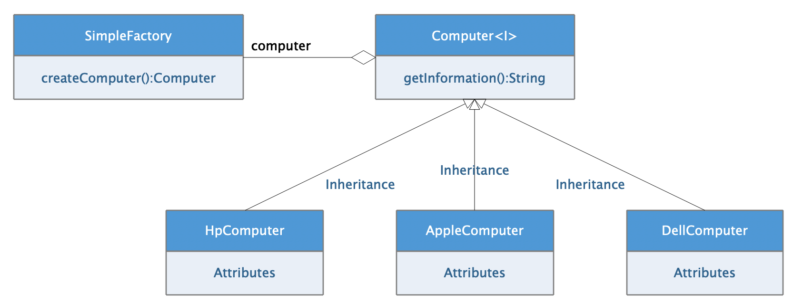

# 1、 简单工厂模式概述

简单工厂模式是一种`创建模式`，又称为`静态工厂方法模式`，但是需要注意的是它不属于`GOF23种设计模式`之一。

>   简单工厂模式是由一个工厂对象决定创建出哪一种产品类的实例，简单工厂模式是工厂模式家族中最简单的一种应用实现。

## 1.1、简单工厂模式核心组件

该模式中包含了核心的几个角色用于完成整体项目架构

-   工厂（Creator）角色
    -   简单工厂模式的核心组件，负责完成创建实例的所有内部逻辑实现。该工厂实例的创建实例的方法外部可以直接调用用于创建需要的产品对象。
-   抽象产品（Product）角色
    -   简单工厂模式用于可创建的所有对象的父类，负责描述所有实例公共的接口定义。
-   具体产品（Concrete Product）角色
    -   简单工厂模式的创建目标，所有创建对象都是基于某个具体的实例。

具体的架构组件如下图所示：




## 1.2、简单工厂模式优缺点

**优点：**

工厂类是整个模式的关键.包含了必要的逻辑判断,根据外界给定的信息,决定究竟应该创建哪个具体类的对象.通过使用工厂类,外界可以从直接创建具体产品对象的尴尬局面摆脱出来,仅仅需要负责“消费”对象就可以了。而不必管这些对象究竟如何创建及如何组织的．明确了各自的职责和权利，有利于整个软件体系结构的优化。

**缺点：**

由于工厂类集中了所有实例的创建逻辑，违反了高内聚责任分配原则，将全部创建逻辑集中到了一个工厂类中；它所能创建的类只能是事先考虑到的，如果需要添加新类，则就需要改变工厂类了。当系统中的具体产品类不断增多时候，可能会出现要求工厂类根据不同条件创建不同实例的需求．这种对条件的判断和对具体产品类型的判断交错在一起，很难避免模块功能的蔓延，对系统的维护和扩展非常不利；这些缺点在工厂方法模式中得到了一定的克服


# 2、` Java`实现

## 公共父类定义

```java
package com.damu.pojo;

/**
 * <p>项目文档： 产品抽象父类，公共接口定义</p>
 *
 * @author 大牧
 * @version V1.0
 */
public interface Computer {

    /**
     * 获取品牌信息
     * @return 电脑品牌信息
     */
    String getInformation();
}

```

## 产品具体实现类

```java
package com.damu.pojo.impl;

import com.damu.pojo.Computer;

/**
 * <p>项目文档：  产品具体实现</p>
 *
 * @author 大牧
 * @version V1.0
 */
public class HpComputer implements Computer {

    public String getInformation() {
        return "HP 惠普电脑 Inter CPU i7 / 8G";
    }

}
-----------------------------------------------------
package com.damu.pojo.impl;

import com.damu.pojo.Computer;

/**
 * <p>项目文档： 产品具体实现</p>
 *
 * @author 大牧
 * @version V1.0
 */
public class DellComputer implements Computer {

    public String getInformation() {
        return "Alienware 2018 戴尔旗下外星人电脑";
    }

}
-----------------------------------------------------
package com.damu.pojo.impl;

import com.damu.pojo.Computer;

/**
 * <p>项目文档： 产品具体实现</p>
 *
 * @author 大牧
 * @version V1.0
 */
public class AppleComputer implements Computer {

    public String getInformation() {
        return "MacOS 2018 苹果电脑";
    }

}
```

## 简单工厂定义

```java
package com.damu.factory;

import com.damu.pojo.Computer;
import com.damu.pojo.impl.AppleComputer;
import com.damu.pojo.impl.DellComputer;
import com.damu.pojo.impl.HpComputer;

/**
 * <p>项目文档： 简单工厂类，实现创建对象的方法</p>
 *
 * @author 大牧
 * @version V1.0
 */
public class SimpleFactory {

    /**
     * 工厂方法
     * @param brand 创建电脑的品牌
     * @return 返回创建好的对象
     */
    public static Computer createComputer(String brand) {
        Computer computer = null;
        if ("HP".equals(brand)) {
            computer = new HpComputer();
        } else if ("MAC".equals(brand)) {
            computer = new AppleComputer();
        } else if ("DELL".equals(brand)) {
            computer = new DellComputer();
        }
        return computer;
    }
}
```

## 代码运行测试：

```java
package com.damu;

import com.damu.factory.SimpleFactory;
import com.damu.pojo.Computer;

/**
 * <p>项目文档： TODO</p>
 *
 * @author 大牧
 * @version V1.0
 */
public class Main {

    public static void main(String[] args) {
        // 创建对应的电脑对象
        Computer computer = SimpleFactory.createComputer("DELL");
        System.out.println(computer.getInformation());

        Computer computer2 = SimpleFactory.createComputer("MAC");
        System.out.println(computer2.getInformation());
    }
}
```

运行结果如下：

```java
Alienware 2018 戴尔旗下外星人电脑
MacOS 2018 苹果电脑
```


# 3、 `Python`实现

`Python`作为弱类型的脚本语言，本身就已经支持大量的设计模式，这里通过语法糖的形式还原设计模式的实现还原`Java`中的同类型设计模式。

## 公共父类定义

```python
"""
简单工厂模式实现
"""
import abc


class Computer(metaclass=abc.ABCMeta):
    """
    产品公共父类
    """
    @abc.abstractmethod
    def get_information(self):
        raise NotImplementedError("当前方法必须在子类中实现.")


class HpComputer(Computer):
    """
    产品具体实现：惠普电脑
    """
    def get_information(self):
        return "Hp 惠普电脑 8 CORES CPUS | 8G"


class AsusComputer(Computer):
    """
    产品具体实现：华硕电脑
    """
    def get_information(self):
        return "ASUS 华硕品质 坚若磐石"


class SimpleFactory:
    """
    简单工厂类
    """

    @classmethod
    def get_computer(cls, brand):
        """
        创建电脑的静态工厂方法
        :param brand: 品牌参数
        :return:  返回创建的电脑对象
        """
        computer = None
        if brand == "HP":
            computer = HpComputer()
        elif brand == "ASUS":
            computer = AsusComputer()

        return computer


if __name__ == "__main__":
    """测试代码"""
    c1 = SimpleFactory.get_computer("HP")
    print(c1.get_information())

    c2 = SimpleFactory.get_computer("ASUS")
    print(c2.get_information())
```


# 4、 `Go`实现

定义产品抽象接口

```go
/*
产品抽象接口
 */
type Computer interface {
	/*
	获取信息的抽象方法
	 */
	GetInformation() string
}
```

定义具体产品信息

```go
/*
结构体实现
 */
type HpComputer struct {
}
// 实现接口方法
func (hpComputer HpComputer) GetInformation() string {
	return "惠普电脑来一台"
}

/*
结构体实现
 */
type MacComputer struct{
}
// 实现接口方法
func (macComputer MacComputer) GetInformation() string  {
	return "MacBoot Pro 2018 引领商务本潮流"
}
```

定义简单工厂，在工厂中根据不同的条件创建不同的对象

```go
/*
简单工厂
 */
type SimpleFactory struct {
}
// 实现工厂方法
func (simpleFactory SimpleFactory) GetComputer(brand string) Computer  {
	var computer Computer
	switch brand {
	case "HP":
		computer = new(HpComputer)
	case "MAC":
		computer = new(MacComputer)
	}

	return computer
}
```

测试代码：

```go
func main() {
	// 创建一个工厂对象
	factory := new(SimpleFactory)

	// 通过工厂对象获取电脑产品实例
	hp := factory.GetComputer("HP")
	fmt.Println(hp.GetInformation())

	mac := factory.GetComputer("MAC")
	fmt.Println(mac.GetInformation())

}
```

执行结果如下：

```
#gosetup
惠普电脑来一台
MacBoot Pro 2018 引领商务本潮流
```

