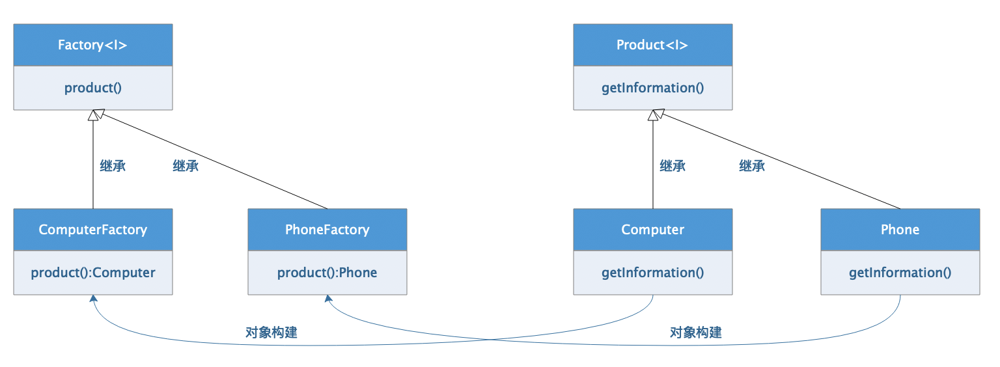

# 1、 工厂方法模式概述

工厂方法模式是一种`创建模式`，又被称为`虚拟构造子模式(Virtual Constructor)`或者`多态性工厂模式(Polymoriphoic Factory)`。工厂方法模式是目标是定义一个创建产品对象的工厂接口，将实际创建工作推迟到子类中。

## 1.1、 工厂方法模式核心组件

工厂方法模式是在简单工厂模式上的改进，主要包含如下几个角色及组件

-   抽象工厂（Creator）：整个工厂模式的核心角色，它与应用无关，主要在创建模式中规范和产品对应的工厂对象的标准化定义。
-   具体工厂（Concrete Creator）：实现了抽象工厂的具体工厂类，该类型是和应用直接交互的具体实现类，在应用程序中调用，用于创建产品对象。
-   抽象产品（Product）：工厂方法模式创建的所有类型的超级父类，该类型和具体业务有关，用于规范工厂方法模式中创建的方法对象具备的公共特征行为。
-   具体产品（Concrete Product）：该类型实现了抽象产品 父类，是工厂方法模式中具体创建的实例对象。



## 1.2、 工厂方法模式优缺点

**优点：**

在简单工厂模式上的改进，核心工厂类不再负责所有产品的构建，而是将具体的工作交给子类进行实现，不再接触和业务相关的具体细节，如此进一步抽象的结果，最直接的作用就是在满足`OCP原则`的基础上实现了功能的扩展。

**缺点：**

软件的水平功能扩展已经非常可观，但是对于新功能扩展，灵活性上稍有欠缺，在横向扩展时如果出现新的业务逻辑就需要更改原有的工厂类型代码予以满足了。


>   在本章节的代码演示中，为了能用最简洁的逻辑结构说明工厂方法模式，不进行多层构建，大家看代码的时候可以自行拓展。

# 2、 `Java`实现

## （1）  核心工厂声明

```java
package com.damu.inter;

/**
 * <p>项目文档： 工厂接口</p>
 * @author 大牧
 * @version V1.0
 */
public interface IFactory<T> {
    /**
     * 获取具体产品实例的方法
     * @return 返回创建的实例对象
     */
    T product();
}
```


## （2） 核心产品声明

```java
package com.damu.inter;

/**
 * <p>项目文档： 产品接口</p>
 *
 * @author 大牧
 * @version V1.0
 */
public interface IProduct {

    /**
     * 产品类型的公共方法
     * @return 返回产品信息
     */
    String getInformation();
}
```


## （3）  产品具体实现

为了简洁起见，我们直接实现`IProduct`接口完成具体产品类的定义，不再进行多层声明。

```java
package com.damu.inter.product.impl;

import com.damu.inter.IProduct;

/**
 * <p>项目文档： 产品具体实现</p>
 *
 * @author 大牧
 * @version V1.0
 */
public class PhoneProduct implements IProduct {
    @Override
    public String getInformation() {
        return "电视很NB，报纸很NB，杂志很NB，游戏机很NB，小说很NB，最终都被手机干掉了";
    }
}
```

```java
package com.damu.inter.product.impl;

import com.damu.inter.IProduct;

/**
 * <p>项目文档： TODO</p>
 *
 * @author 大牧
 * @version V1.0
 */
public class ComputerProduct implements IProduct {
    @Override
    public String getInformation() {
        return "电脑，官方称呼计算机，主要用于进行数据运算的一台机器。";
    }
}
```


## （4）  工厂具体实现

```java
package com.damu.inter.factory.impl;

import com.damu.inter.IFactory;
import com.damu.inter.IProduct;
import com.damu.inter.product.impl.PhoneProduct;

/**
 * <p>项目文档： 具体工厂</p>
 *
 * @author 大牧
 * @version V1.0
 */
public class PhoneFactory implements IFactory<IProduct> {
    @Override
    public PhoneProduct product() {
        // 工厂标准方法中，完成指定产品对象的构建
        return new PhoneProduct();
    }
}
```

```java
package com.damu.inter.factory.impl;

import com.damu.inter.IFactory;
import com.damu.inter.IProduct;
import com.damu.inter.product.impl.ComputerProduct;

/**
 * <p>项目文档： TODO</p>
 *
 * @author 大牧
 * @version V1.0
 */
public class ComputerFactory implements IFactory<IProduct> {
    @Override
    public ComputerProduct product() {
        // 工厂方法标注方法：完成对象的创建并返回
        return new ComputerProduct();
    }
}
```

## （5）  代码测试

```java
package com.damu;

import com.damu.inter.IFactory;
import com.damu.inter.IProduct;
import com.damu.inter.factory.impl.ComputerFactory;
import com.damu.inter.factory.impl.PhoneFactory;
import com.damu.inter.product.impl.ComputerProduct;
import com.damu.inter.product.impl.PhoneProduct;

/**
 * <p>项目文档： TODO</p>
 *
 * @author 大牧
 * @version V1.0
 */
public class Main {

    public static void main(String[] args) {
        // 创建工厂对象
        IFactory<IProduct> phoneFactory = new PhoneFactory();
        // 通过工厂穿件具体对象
        IProduct phoneProduct = phoneFactory.product();
        System.out.println(phoneProduct.getInformation());

        // 创建工厂对象
        IFactory<IProduct> computerFactory = new ComputerFactory();
        // 通过工厂创建具体对象
        IProduct computerProduct = computerFactory.product();
        System.out.println(computerProduct.getInformation());

    }
}
```

在测试代码中，我们可以观察到在获取到统一的工厂实例对象后，通过工厂实例创建的具体产品对象，是根据在构建的时候的具体工厂决定的，也就是具体工厂和具体产品之间的业务关系是比较紧密的，运行结果如下：

```shell
/Library/../classes com.damu.Main
电视很NB，报纸很NB，杂志很NB，游戏机很NB，小说很NB，最终都被手机干掉了
电脑，官方称呼计算机，主要用于进行数据运算的一台机器。
```


# 3、 `Python`实现

还原`Java工厂方法模式`的实现

```python
"""
工厂方法模式
"""
import abc


class IFactory(metaclass=abc.ABCMeta):
    """工厂接口"""

    @abc.abstractmethod
    def product(self):
        raise NotImplementedError("该方法必须在工厂子类中实现")


class IProduct(metaclass=abc.ABCMeta):
    """产品接口"""

    @abc.abstractmethod
    def get_information(self):
        raise NotImplementedError("该方法必须在产品子类中实现")


class PhoneProduct(IProduct):
    """手机产品"""

    def get_information(self):
        return "电视很NB，报纸很NB，杂志很NB，游戏机很NB，小说很NB，最终都被手机干掉了"


class ComputerProduct(IProduct):
    """电脑产品"""

    def get_information(self):
        return "电脑，官方称呼计算机，主要用于进行数据运算的一台机器"


class PhoneFactory(IFactory):
    """手机工厂"""

    def product(self):
        """生产手机对象的工厂方法"""
        return PhoneProduct()


class ComputerFactory(IFactory):
    """电脑工厂"""

    def product(self):
        """生产电脑对象的工厂方法"""
        return ComputerProduct()


if __name__ == "__main__":
    """测试代码"""
    # 创建工厂实例
    phoneFactory = PhoneFactory()
    # 创建产品
    phone = phoneFactory.product()
    print(phone.get_information())

    # 创建电脑工厂
    computerFactory = ComputerFactory()
    # 创建产品
    computer = computerFactory.product()
    print(computer.get_information())
```


# 4、 `Go`实现

## 4.1、 定义工厂及产品接口

```go
package main

import "fmt"

/*
定义产品接口
*/
type IProduct interface {
	// 获取产品信息的方法
	GetInformation() string
}

/*
定义工厂接口
 */
type IFactory interface {
	// 生产产品的方法
	product() IProduct
}
```

## 4.2、 构建具体产品类型

```go
/*
定义具体产品：手机、电脑
 */
type PhoneProduct struct {}
// 实现工厂方法
func (phone PhoneProduct) GetInformation() string {
	return "电视很NB，报纸很NB，杂志很NB，游戏机很NB，小说很NB，最终都被手机干掉了"
}

/*
产品：电脑
 */
type ComputerProduct struct{}
// 实现工厂方法
func (computer ComputerProduct) GetInformation() string {
	return "电脑，官方称呼计算机，主要用于进行数据运算的一台机器。"
}

```

## 4.3、 构建具体工厂类型

```go
/*
具体工厂：手机工厂
 */
type PhoneFactory struct{}
// 实现接口方法
func (phoneFactory PhoneFactory) product() IProduct  {
	return new(PhoneProduct)
}

/*
具体工厂：电脑工厂
 */
type ComputerFactory struct{}
// 实现接口方法
func (computerFactory ComputerFactory) product() IProduct  {
	return new(ComputerProduct)
}
```

## 4.4、测试代码

```go
func main()  {
	// 创建工厂对象
	phoneFactory := new(PhoneFactory)
	// 创建具体对象
	phone := phoneFactory.product()
	fmt.Println(phone.GetInformation())

	// 创建工厂对象
	computerFactory := new(ComputerFactory)
	// 创建具体对象
	computer := computerFactory.product()
	fmt.Println(computer.GetInformation())
}
```

