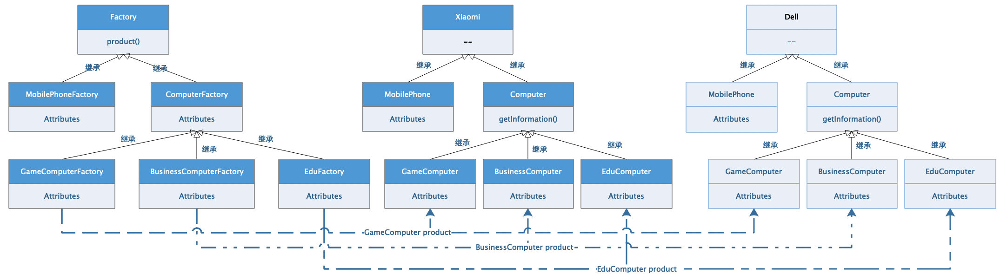

# 1、 抽象工厂模式概述

抽象工厂模式（`Abstract Factory`）[`GOF95`]是一种对象的创建模式，是在`工厂方法模式`上的又一次改进，主要应用于多等级产品结构的项目架构中，将`产品对象的创建过程`和`产品对象的使用`过程解耦合，使用抽象工厂模式的架构中业务模型从工厂对象中获取到产品对象，只需要关注产品对象的使用即可，而可能添加了较为复杂业务逻辑的创建过程封装在工厂内部，让系统中各个模块的责任更加明确。


## 1.1、 核心组件

`抽象工厂模式`中的核心组件，主要是对多等级类型架构的一种解决方案，核心包含了高度抽象的工厂接口，产品接口以及具体的实现过程，其架构如图所示：



-   抽象工厂角色【Abstract Factory】：上图中的`Factory`，抽象工程概念方法模式的核心，与应用系统的商业逻辑无关，主要是工厂方法标准化的定义和构建。
-   具体工厂角色【Concrete Factory】：上图中的`MobileFactory`以及`ComputerFactory`，该角色包含具体产品对象的创建业务逻辑，在使用时可以直接调用创建对应的产品对象。
-   抽象产品角色【Abstract Product】：上图中的`Xiaomi`或者`Dell`，抽象产品体系可以是1到n套相同体系的产品结构，抽象产品体系的公共数据抽象就是抽象产品角色。
-   具体产品角色【Concrete Product】：具体业务逻辑的实现类型，由具体工厂角色负责创建的实例对象，包含了具体业务处理逻辑的实例。


## 1.2、 优点缺点

抽象工厂模式最早是在操作系统构建过程中落地的一个设计概念，不同的操作系统在处理窗口以及窗口中的按钮、文字时涉及到类似的构建过程，在该架构模式下工厂架构和对应的产品架构之间会产生对应的耦合关系，在业务逻辑中必须使用具体的某个产品系列，可以支持相似架构的其他产品系列，如果是类似的模式可以通过抽象工厂设计模式进行架构，作为创建模式中一种非常经典的设计模式，是很多设计模式的最原始的实现架构，在该模式的基础上可以变通实现多种设计实现。

优点：

-   产品的创建、组合和表现形式解耦合，在系统中形成两套不同的体系，将构建与业务分离。
-   多个产品系统可以无缝切换，并且不会影响整体系统的稳定性。
-   客户端依赖系统的抽象层，所有产品体系结构相似，客户端不依赖产品实现。
-   系统整体扩展性提高，满足OCP原则。

缺点：

-   多个产品体系必须相似【固定架构模式，设计约束性较高】
-   业务无关代码的冗余较多。

# 2、 `Java`实现

## 2.1、 工厂及产品结构的定义

```java
package com.damu.inter;

/**
 * <p>项目文档： 抽象工厂声明</p>
 *
 * @author 大牧
 * @version V1.0
 */
public interface IFactory<T> {
    /**
     * 产品创建方法
     * @param objects 参数列表
     * @return 创建好的产品对象
     */
    T product(Object ... objects);
}
---------------------------------------------
package com.damu.inter;

/**
 * <p>项目文档： 抽象产品声明</p>
 *
 * @author 大牧
 * @version V1.0
 */
public interface IProduct {
    String getInformation();
}
```

## 2.2、 具体工厂类的实现

**游戏本工厂类**

```java
package com.damu.factory;

import com.damu.inter.IFactory;
import com.damu.inter.IProduct;
import com.damu.product.XiaomiGameComputer;

/**
 * <p>项目文档： 游戏计算机制造工厂类</p>
 *
 * @author 大牧
 * @version V1.0
 */
public class GameComputerFactory implements IFactory<IProduct> {

    @Override
    public IProduct product(Object... objects) {
        return null;
    }

    /**
     * 小米游戏本制造方法
     * @return 小米游戏本
     */
    public IProduct productXiaomi() {
        return new XiaomiGameComputer();
    }

    /**
     * Dell游戏本制造方法
     * @return Dell游戏本
     */
    public IProduct productDell() {
        return null;
    }
}
```

**商务本工厂处理类**

```java
package com.damu.factory;

import com.damu.inter.IFactory;
import com.damu.inter.IProduct;
import com.damu.product.XiaomiBusinessComputer;

/**
 * <p>项目文档： 商务计算机制造工厂类</p>
 *
 * @author 大牧
 * @version V1.0
 */
public class BusinessComputerFactory implements IFactory<IProduct> {

    @Override
    public IProduct product(Object... objects) {
        return null;
    }

    /**
     * 小米商务本制造方法
     * @return 小米商务本对象
     */
    public IProduct productXiaomi() {
        return new XiaomiBusinessComputer();
    }

    /**
     * 戴尔商务本制造方法
     * @return 戴尔商务本
     */
    public IProduct productDell() {
        return null;
    }
}

```

**学生本工厂处理类**

```java
package com.damu.factory;

import com.damu.inter.IFactory;
import com.damu.inter.IProduct;
import com.damu.product.XiaomiEduComputer;

/**
 * <p>项目文档： 学生计算机制造工厂类</p>
 *
 * @author 大牧
 * @version V1.0
 */
public class EduComputerFactory implements IFactory<IProduct> {
    @Override
    public IProduct product(Object... objects) {
        return null;
    }

    /**
     * 小米学生本制造方法
     * @return 小米学生本
     */
    public IProduct productXiaomi() {
        return new XiaomiEduComputer();
    }

    /**
     * Dell学生本制造方法
     * @return Dell学生本
     */
    public IProduct productDell() {
        return null;
    }
}

```

具体产品体系的父类构建

```java
package com.damu.inter.extend;

import com.damu.inter.IProduct;

/**
 * <p>项目文档： Dell产品父类</p>
 *
 * @author 大牧
 * @version V1.0
 */
public interface IDell extends IProduct {
}
----------------------------------------------
package com.damu.inter.extend;

import com.damu.inter.IProduct;

/**
 * <p>项目文档： 小米产品父类</p>
 *
 * @author 大牧
 * @version V1.0
 */
public interface IXiaomi extends IProduct {
}
```

具体产品构建

```java
package com.damu.product;

import com.damu.inter.extend.IXiaomi;

/**
 * <p>项目文档： TODO</p>
 *
 * @author 大牧
 * @version V1.0
 */
public class XiaomiGameComputer implements IXiaomi {
    @Override
    public String getInformation() {
        return "小米游戏本，最佳性价比";
    }
}
--------------------------------------------
package com.damu.product;

import com.damu.inter.extend.IXiaomi;

/**
 * <p>项目文档： TODO</p>
 *
 * @author 大牧
 * @version V1.0
 */
public class XiaomiBusinessComputer implements IXiaomi {
    @Override
    public String getInformation() {
        return "小米商务本，最佳选择";
    }
}
--------------------------------------------
package com.damu.product;

import com.damu.inter.extend.IDell;

/**
 * <p>项目文档： TODO</p>
 *
 * @author 大牧
 * @version V1.0
 */
public class DellGameComputer implements IDell {
    @Override
    public String getInformation() {
        return "Dell游戏，Alienware，王者归来";
    }
}

package com.damu.product;

import com.damu.inter.extend.IXiaomi;

/**
 * <p>项目文档： TODO</p>
 *
 * @author 大牧
 * @version V1.0
 */
public class XiaomiEduComputer implements IXiaomi {
    @Override
    public String getInformation() {
        return "小米学生本，学生党的福利";
    }
}
--------------------------------------------
package com.damu.product;

import com.damu.inter.extend.IDell;

/**
 * <p>项目文档： TODO</p>
 *
 * @author 大牧
 * @version V1.0
 */
public class DellGameComputer implements IDell {
    @Override
    public String getInformation() {
        return "Dell游戏，Alienware，王者归来";
    }
}
--------------------------------------------more.....
```

测试代码，使用工厂构建产品过程

```java
package com.damu.main;

import com.damu.factory.GameComputerFactory;
import com.damu.inter.IFactory;
import com.damu.inter.IProduct;
import com.damu.product.XiaomiGameComputer;

/**
 * <p>项目文档： TODO</p>
 *
 * @author 大牧
 * @version V1.0
 */
public class Main {

    public static void main(String[] args) {
        // 创建工厂对象
        GameComputerFactory factory = new GameComputerFactory();

        // 创建小米游戏本
        IProduct productXiaomi = factory.productXiaomi();
        System.out.println(productXiaomi.getInformation());
        // 创建Dell游戏本
        IProduct productDell = factory.productDell();
        System.out.println(productDell.getInformation());

        // more....
    }
}
```


# 3、 `Python`实现

```python
"""
抽象工厂模式
"""
import abc


# ------------------------------------------ 接口层
class IFactory(metaclass=abc.ABCMeta):
    """工厂接口"""

    @abc.abstractmethod
    def product(self):
        raise NotImplementedError("该方法必须在子类中实现")


class IProduct(metaclass=abc.ABCMeta):
    """产品抽象接口"""

    def get_information(self):
        raise NotImplementedError("该方法必须在产品子类中实现")


# ------------------------------------------ 抽象层
class DellComputer(IProduct):
    """Dell电脑产品抽象类"""
    pass


class XiaomiComputer(IProduct):
    """小米产品抽象类"""
    pass


# ------------------------------------------ 实现层
class XiaomiGameComputer(IProduct):
    """产品具体：小米游戏本"""

    def get_information(self):
        print("小米游戏，品质佳轩")


class DellGameComputer(IProduct):
    """产品具体：Dell游戏本"""

    def get_information(self):
        print("Dell游戏，Alienware出击")


class GameComputerFactory(IFactory):
    """游戏本工厂处理类"""

    def product(self):
        print("小米游戏本：product_xiaomi(); Dell游戏本：product_dell()")

    def product_xiaomi(self):
        return XiaomiGameComputer()

    def product_dell(self):
        return DellGameComputer()

# 其他 具体产品 对应 具体工厂 产品体系和工厂体系保持一致即可


if __name__ == "__main__":
    # 创建工厂对象
    game_factory = GameComputerFactory()

    # 创建具体产品
    xiao_mi = game_factory.product_xiaomi()

    dell = game_factory.product_dell()

    # 打印
    xiao_mi.get_information()
    dell.get_information()
```


# 4、 `Go`实现

```go
package main

import "fmt"

/*************** 接口层 ****************/
type IProduct interface {
	// 抽象产品接口
	GetInformation() string
}

type IFactory interface {
	// 抽象工厂接口
	product() IProduct
}

/*************** 抽象产品层 ****************/
type XiaomiComputer interface {
	IProduct
}

type DellComputer interface {
	IProduct
}

/*************** 具体产品层 ****************/
type XiaomiGameComputer struct {
	XiaomiComputer
}

func (computer XiaomiGameComputer) GetInformation() string {
	return "小米游戏，品质佳选"
}

type DellGameComputer struct {
	DellComputer
}

func (computer DellGameComputer) GetInformation() string {
	return "Alienware，笔记本中的王者"
}

/*************** 具体工厂层 ****************/
type GameComputerFactory struct {}

func (gameComputerFactory GameComputerFactory) product_xiaomi() IProduct {
	return new(XiaomiGameComputer)
}

func (gameComputerFactory GameComputerFactory) product_dell() IProduct {
	return new(DellGameComputer)
}

/*************** 具体测试 ****************/
func main()  {
	// 创建工厂对象
	gameComputerFactory := new(GameComputerFactory)

	// 创建具体产品
	dellComputer := gameComputerFactory.product_dell()
	fmt.Println(dellComputer.GetInformation())

	xiaomiComputer := gameComputerFactory.product_xiaomi()
	fmt.Println(xiaomiComputer.GetInformation())
}
```

