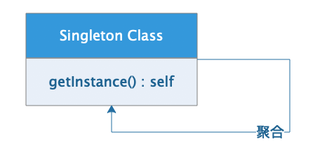

[TOC]

# 1、单例模式概述

单例模式（`Singleton`）[`GOF95`]是一种对象的创建模式，确保系统中使用了单例模式的类型只会存在一个实例对象，通过该对象给系统提供一致性的解决方案。

单例模式管理的类型，常规情况下具备如下特性

-   单例类只能有一个实例
-   单例类必须自己创建属于自己的唯一实例对象。
-   单例类必须给其他调用者提供自己的实例对象。

>   注意：在项目开发过程中，项目可能会存在需要限定多个实例的情况，所以单例模式是一个基础模式，可以在此模式基础上衍生`多例模式`。

单例实现过程中，根据实例的创建时机区分为`饿汉式单例` 和 `懒汉式单例` 两种不同的操作方式，所谓`饿汉式`表示在类型定义时在类型中已经创建了对应的实例，其他调用者可以随时调用获取；所谓`懒汉式`是在类型定义时定义了单例的实现逻辑，但是只有调用者在使用该单例时，第一次调用时才会发生具体实例化过程，之后再使用过程中该实例就是唯一的提供服务的对象。

## 1.1、 核心组件

单例模式中，最核心的部分就是当前类型自己，为了符合需求中对于单例的使用要求，通常情况下我们会设计当前类型自己的静态方法来获取该类型的实例，并且当前类型不可实例化（构造方法私有化）。

-   单例类（Singleton Class）：单例模式的核心类型，和系统中的业务逻辑紧密关联，实例的创建部分的处理由自身的静态方法完成，对外只暴露包含业务功能的单个实例对象。



## 1.2、 优点缺陷

单例类的设计通常是基于某些系统功能的要求，一般情况下是基于功能上的限制或者业务上的要求，某一部分功能业务逻辑在整个系统平台的运行周期中，必须是让所有功能模块共享的独立一份，此时单例模式的应用能简单开发过程中的业务逻辑的复杂度，但是注意单例模式并不是唯一的解决方案。

**优点**

-   能有好的处理系统中独立一份数据的共享和信息传递
-   减少内存开销，避免资源过度占用

缺点

-   对于`DIP原则`以及`OCP原则`支持不友好，功能扩展不方便

# 2、 `Java`实现

## 2.1、饿汉式单例模式

饿汉式单例模式基础代码，如有功能或者业务逻辑上的需要，可以在此基础上进行扩展。

```java
/**
 * <p>项目文档： TODO</p>
 *
 * @author 大牧
 * @version V1.0
 */
public class SingletonForHungry {

    // 1. 内部属性中直接实例化当前对象
    private static SingletonForHungry myInstance = new SingletonForHungry();

    // 2. 构造方法私有化，屏蔽外界实例化途径
    private SingletonForHungry () {}

    // 3. 提供获取实例对象的静态方法
    public static SingletonForHungry getInstance() {
        return myInstance;
    }

}
```

测试代码，请独立创建一个入口类进行测试

```java
/**
 * <p>项目文档： TODO</p>
 *
 * @author 大牧
 * @version V1.0
 */
public class SingletonMain {
    public static void main(String[] args) {
        // 测试代码
        SingletonForHungry sf = SingletonForHungry.getInstance();
        System.out.println(sf); // SingletonForHungry@61bbe9ba

        SingletonForHungry sf2 = SingletonForHungry.getInstance();
        System.out.println(sf2); // SingletonForHungry@61bbe9ba

//        SingletonForHungry sf3 = new SingletonForHungry();// ERROR
//        System.out.println(sf3);
    }
}
```


## 2.2、 懒汉式单例模式

```java
/**
 * <p>项目文档： 懒汉式单例模式</p>
 *
 * @author 大牧
 * @version V1.0
 */
public class SingletonForLazy {

    // 1. 声明一个存放实例对象的变量
    private static SingletonForLazy myInstance;

    // 2. 构造方法私有化
    private SingletonForLazy() {}

    // 3. 提供获取当前类型实例对象的静态方法
    public static SingletonForLazy getInstance() {
        myInstance = myInstance == null ? new SingletonForLazy():myInstance;
        return myInstance;
    }
}
```

测试代码：

```java
/**
 * <p>项目文档： TODO</p>
 *
 * @author 大牧
 * @version V1.0
 */
public class SingletonMain {
    public static void main(String[] args) {
         // 懒汉式单例 测试代码
        SingletonForLazy sl = SingletonForLazy.getInstance();
        System.out.println(sl); // SingletonForLazy@61bbe9ba

        SingletonForLazy sl2 = SingletonForLazy.getInstance();
        System.out.println(sl2); // SingletonForLazy@61bbe9ba

//        SingletonForLazy sl3 = new SingletonForLazy();// ERROR
//        System.out.println(sl3);
    }
}
```

>   注意：这里的单例模式，主要是业务上的限制，并不代表在代码执行过程中外界不能干预，比如通过反射的方式实例化单例类的其他实例，但是根本上来说只要符合需求的模式下，单例模式能解决我们在项目中遇到的通用问题，也就是单例模式就是一种解决方案，会因不同的场景而进行不同的设计。

# 3、 `Python`实现

`Python`本身是弱类型语言，所以单例模式的实现手段较多，我们这里简单给大家展示几种操作方式。

## 3.1、 单实例操作

`Python`中的一切都是数据都是对象，包括类型的声明定义也是一种对象，在操作过程中根据这一特性我们可以直接构建单例模式

```python
singleton.py
-------------------------------------------
"""
单例模式
"""
# 实现1：单实例操作
class Singleton:
    pass

# 创建实例对象
singleton_instalce = Singleton()
# 删除类定义
del Singleton
print(singleton_instalce) # <__main__.Singleton object at 0x10c221080>

singleton_instalce2 = Singleton() # NameError: name 'Singleoton' is not defined
print(singleton_instalce2)
```

上述代码中，通过类型`Singleton`可以很方便的创建属于该类型的对象`singleton_instance`，完成对象创建后删除了类型的定义，在后续的代码使用过程中，利用`Python`语言本身的特性，可以通过`import`方式使用该单例对象，其他`Python`模块中可以按照如下方式引入使用

```python
# 引入单例实例
from singleton import singleton_instance
```


## 3.2、 静态方法

通过类型的静态方法，提供一个获取当前类型实例化的公共API，在业务上限制该实例的单例操作模式

```python
# 实现2：静态方法
import threading
class Singleton:

    _instance_lock = threading.Lock()

    @classmethod
    def get_instance(self, *args, **kwargs):
        """获取当前实例的静态方法"""
        if not hasattr(Singleton, "_my_instance"):
            # 线程锁，保证多线程访问安全
            with Singleton._instance_lock:
                Singleton._my_instance = Singleton()
        return Singleton._my_instance

singleton = Singleton.get_instance()
print(singleton) #<__main__.Singleton object at 0x102dc00f0>

singleton2 = Singleton.get_instance()
print(singleton2) #<__main__.Singleton object at 0x102dc00f0>
```

但是上述的单例操作中，不排除开发人员可能会通过类型直接构建对象的行为，代码如下：

```python
singleton3 = Singleton()
print(singleton3) #<__main__.Singleton object at 0x1012c00b8>
```

所以我们在这里操作的单例模式，描述为添加了业务限制的单例操作，在业务要求中如果要使用该类型的实例必须通过`get_instance()`方法进行获取。


## 3.3、 `__new__`魔法方法

`Python`中的类型在实例化过程中，逐次调用了`__new__(cls)`进行实例的构建和`__init__(self)`进行数据的初始化操作，我们通过`__new__(cls)`魔法方法直接完成单例的处理，是`Python`中最常见的一种操作方式。

```python
# 实现3：__new__()魔法方法
class Singleton:

    import threading
    _instance_lock = threading.Lock()

    def __init__(self, name):
        self.name = name

    def __new__(cls, *args, **kwargs):
        """构建方法"""
        if not hasattr(Singleton, "_instance"):
            with Singleton._instance_lock:
                Singleton._instance = object.__new__(cls)

        return Singleton._instance

# 分别创建两个不同的实例
singleton = Singleton("tom")
singleton2 = Singleton("jerry")
# 查看两个不同实例的属性数据和内存地址
print(singleton, singleton.name) # <__main__.Singleton object at 0x101d13128> jerry
print(singleton2, singleton2.name) # <__main__.Singleton object at 0x101d13128> jerry
```

通过上述代码可以看到，不同时间创建的对象，最终的数据都是一致的，包括在内存中的地址，也就是表明了当前的多个实例是同一个内存中的的对象数据，因为添加了线程锁，所以该单例模式即使在多线程环境下也是安全的。

## 3.4、 装饰器实现

上述的几种实现方式都非常有好，尤其是通过`__new__(cls)`的实现操作，但是在实际开发过程中代码的复用性并不是非常好，我们可以使用`Python`中的装饰器完成单例模式的检查约束，同时也保证了代码的复用性。但是装饰器的操作模式并不是全部适用，如果一个系统中出现大量的单例对象（当然基本不可能出现），装饰器的操作模式就会特别消耗系统资源，废话不多直接看实现

```python

# 实现4：装饰器操作
def singleton(cls):
    """单例类装饰器"""
    # 声明一个存储对象的字典
    _instance = dict()

    def _singleton(*args, **kwargs):
        if cls not in _instance:
            _instance[cls] = cls(*args, **kwargs)

        return _instance
    return _singleton


@singleton
class Single:
    def __init__(self, name):
        self.name = name

s1 = Single("tom")
s2 = Single("jerry")
print(s1) # <class '__main__.Single'>:<__main__.Single object at 0x10b3b10b8>
print(s2) # <class '__main__.Single'>:<__main__.Single object at 0x10b3b10b8>
```

由于`Python`语言本身的灵活性，基于`python`的实现方式比较多，大家可以在实现过程中自行参考。


# 4、 `Go`实现

`Go`语言是通过结构体来定义类型的，所以单例的操作就比较灵活了，这里介绍一种简单的实现操作模式

```go
package main

import (
	"fmt"
	"sync"
)

type Singleton struct {}

var instance *Singleton
var once sync.Once

func GetInstance() *Singleton {
	once.Do(func() {
		fmt.Println("instance invoking....")
		instance = &Singleton{}
	})
	return instance
}
```

