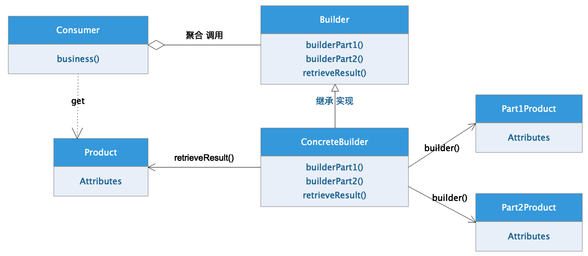

[TOC]


# 1、 `建造模式` 概述

建造模式（`Builder`）[`GOF95`]是一种对象的创造模式。主要责任是在程序中创建较为复杂的对象，企业项目中在运行环境初始化时经常使用的一种创建模式。

## 1.1、 核心组件

建造模式和工厂模式极为相似，都是将对象的构建过程和对象的业务处理分离开来，让不同的类型分别承担对象的创建和对象的使用的责任。

建造模式在构建对象的过程中，目标对象一般都是较为复杂的多个对象或者组件内聚并添加一定业务逻辑的对象组件，并且内部对象构建过程区分前后顺序，核心组件如下：

-   抽象建造者（`Builder`）：规范建造者的一个抽象接口，规范产品建造过程中的步骤和规范，该接口独立于业务逻辑之外，是基于功能拓展的一个抽象依赖。
-   具体建造者（`ConcreteBuilder`）：该类型与具体业务逻辑紧密相关，实现了抽象建造者接口，是具体产品构建过程的执行者。
-   零件/聚合对象（`AggregationProduct`）：该类型的对象是最终对象中包含的具体组成部分，该组成部分可能是对象，也可能是组件或者业务逻辑。
-   产品对象（`Product`）：最终的产品对象，该产品对象是具体建造者最终返回的构建结果，也是我们建造者模式最终产生的和业务逻辑紧密结合的对象。



## 1.2、 优点缺陷

**优点：**

复杂对象的创建分步骤执行，开发难度降低，可读性提升

对象的创建过程和业务处理过程解耦合

**缺陷：**

系统复杂度提升

系统资源消耗增加


# 2、 `Java` 实现

## 2.1、 抽象建造者`Builder`

```java
package com.damu.builder;

/**
 * <p>项目文档： 产品 抽象建造者 </p>
 *
 * @author <a href="https://github.com/laomu/laomu.github.io">大牧</a>
 * @version V1.0
 */
public interface Builder<T> {
    /**
     * 第一个构建步骤
     */
    void builderPart1();

    /**
     * 第二个构建步骤
     */
    void builderPart2();

    /**
     * 获取最终产品
     * @return 最终产品
     */
    T retrieveResult();
}
```


## 2.2、 内聚组件`Aggregation Product`

```java
package com.damu.product;

/**
 * <p>项目文档： 复杂对象-组成部分1-eg:楼房</p>
 *
 * @author <a href="https://github.com/laomu/laomu.github.io">大牧</a>
 * @version V1.0
 */
public class Part1Component {

    private String information;

    public Part1Component(String information) {
        this.information = information;
    }

    public String getInformation() {
        return information;
    }

    public void setInformation(String information) {
        this.information = information;
    }
}
```

```java
package com.damu.product;

/**
 * <p>项目文档： 复杂对象-组成部分1-eg:物业</p>
 *
 * @author <a href="https://github.com/laomu/laomu.github.io">大牧</a>
 * @version V1.0
 */
public class Part2Component {

    private String information;

    public Part2Component(String information) {
        this.information = information;
    }

    public String getInformation() {
        return information;
    }

    public void setInformation(String information) {
        this.information = information;
    }
}
```


## 2.3、 具体产品`Product`

```java
package com.damu.product;

/**
 * <p>项目文档： 具体产品类-eg:小区</p>
 *
 * @author <a href="https://github.com/laomu/laomu.github.io">大牧</a>
 * @version V1.0
 */
public class Product {
    private String information;
    private Part1Component part1;
    private Part2Component part2;

    public String getInformation() {
        return information;
    }

    public void setInformation(String information) {
        this.information = information;
    }

    public Part1Component getPart1() {
        return part1;
    }

    public void setPart1(Part1Component part1) {
        this.part1 = part1;
    }

    public Part2Component getPart2() {
        return part2;
    }

    public void setPart2(Part2Component part2) {
        this.part2 = part2;
    }
}
```


## 2.4、 具体建造者`ConcreteBuilder`

```java
package com.damu.builder;

import com.damu.product.Part1Component;
import com.damu.product.Part2Component;
import com.damu.product.Product;

/**
 * <p>项目文档： 具体建造者</p>
 *
 * @author <a href="https://github.com/laomu/laomu.github.io">大牧</a>
 * @version V1.0
 */
public class ConcreteBuilder implements Builder<Product> {

    private Product product;
    @Override
    public void builderPart1() {
        // builder part1
        Part1Component part1 = new Part1Component("国际工厂-盖楼");
        // other business procedure
        // aggregation
        product.setPart1(part1);
    }

    @Override
    public void builderPart2() {
        // builder part2
        Part2Component part2 = new Part2Component("华夏物理-管理");
        // other business procedure
        // aggregation
        product.setPart2(part2);
    }

    @Override
    public Product retrieveResult() {
        // builder product
        product = new Product();
        product.setInformation("清风小区");
        // step1
        this.builderPart1();
        // other business procedure
        // step2
        this.builderPart2();
        return product;
    }
}
```


## 2.5、业务消费者`Consumer`

```java
package com.damu.main;

import com.damu.builder.Builder;
import com.damu.builder.ConcreteBuilder;
import com.damu.product.Product;

/**
 * <p>项目文档： 消费者</p>
 *
 * @author <a href="https://github.com/laomu/laomu.github.io">大牧</a>
 * @version V1.0
 */
public class Consumer {
    public static void main(String[] args) {
        // 获取建造工厂
        Builder<Product> builder = new ConcreteBuilder();

        // 获取小区对象
        Product product = builder.retrieveResult();

        System.out.println(product);
    }
}
```

```console
# 执行结果
Product{information='清风小区', part1=Part1Component{information='国际工厂-盖楼'}, part2=Part2Component{information='华夏物理-管理'}}
```


# 3、 `Python` 实现

## 3.1、 抽象建造者`Builder`

```python
import abc


class Builder(metaclass=abc.ABCMeta):
    """抽象建造者"""
    def retrieve_result(self):
        """获取产品对象的方法"""
        raise NotImplemented("该方法必须在子类中实现")
```


## 3.2、 内聚组件`Aggregation Product`

```python
class Part1Component:
    """产品部件1"""
    pass


class Part2Component:
    """产品部件2"""
    pass
```


## 3.3、 具体产品`Product`

```python
import abc

class Product(metaclass=abc.ABCMeta):
    """建造者产品接口"""

    @abc.abstractmethod
    def information(self):
        raise NotImplemented("该方法必须实现.")
        
class ConcreteProduct(Product):
    """具体产品对象"""

    def __init__(self):
        self.part1 = None
        self.part2 = None

    def information(self):
        print("目标对象")
```


## 3.4、 具体建造者`ConcreteBuilder`

```python
class ConcreteBuilder(Builder):
    """具体建造类"""

    def __init__(self):
        """初始化"""
        self.product = ConcreteProduct()

    def __build_part1(self):
        # 构建零件对象
        part1_component = Part1Component()
        # 业务受理
        # 聚合
        self.product.part1 = part1_component

    def __build_part2(self):
        # 构建零件对象
        part2_component = Part2Component()
        # 业务受理
        # 聚合
        self.product.part2 = part2_component

    def retrieve_result(self):
        return self.product
```


## 3.5、业务消费者`Consumer`

```python
if __name__ == "__main__":
    """测试代码"""
    # 创建建造者对象
    builder = ConcreteBuilder()
    # 建造目标对象
    product = builder.retrieve_result()
    print(product)
```


# 4、 `Go` 实现

## 3.1、 抽象建造者`Builder`

```go
type Builder interface {
  SetName(name string) Builder
  SetArms(arms string) Builder
  Build() *Character
}
```


## 3.2、 具体产品`Product`

```go
type Character struct {
  Name string
  Arms string
}

func (p *Character) SetName(name string) {
  p.Name = name
}

func (p *Character) SetArms(arms string) {
  p.Arms = arms
}

func (p Character) GetName() string {
  return p.Name
}

func (p Character) GetArms() string {
  return p.Arms
}
```


## 3.3、 具体建造者`ConcreteBuilder`

```go
type CharacterBuilder struct {
  character *Character
}

func (p *CharacterBuilder) SetName(name string) Builder {
  if p.character == nil {
    p.character = &Character{}
  }
  p.character.SetName(name)
  return p
}

func (p *CharacterBuilder) SetArms(arms string) Builder {
  if p.character == nil {
    p.character = &Character{}
  }
  p.character.SetArms(arms)
  return p
}

func (p *CharacterBuilder) Build() *Character {
  return p.character
}
```


## 3.4、业务消费者`Consumer`

```go
type Consumer struct {
  builder Builder
}

func (p Director) Create(name string, arms string) *Character {
  return p.builder.SetName(name).SetArms(arms).Build()
}

func main() {
  var builder Builder = &CharacterBuilder {}
  var consumer *Consumer = &Consumer {builder: builder}
  var character *Character = director.Create("loader", "AK47")
  fmt.Println(character.GetName() + "," + character.GetArms())
}
```

