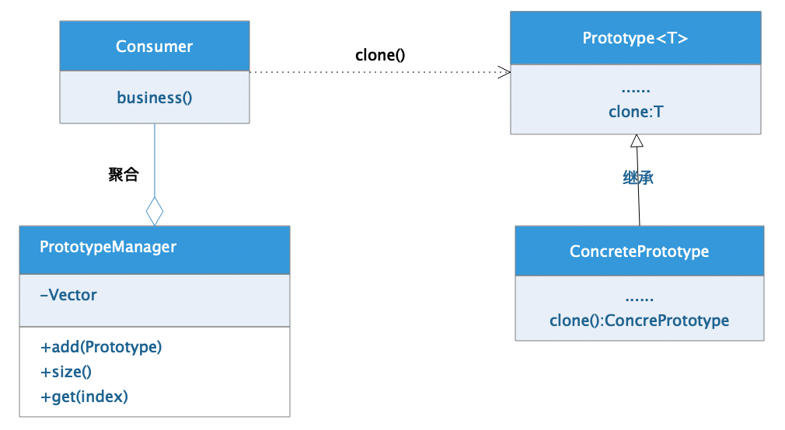

[TOC]

# 1、 `原型模式`概述

原型模式（`Prototype`）[`GOF95`]是一种对象的创建模式，通过给定一个参考的原型对象来指定要创建的对象的类型及数据，然后复制该对象创建更多的相同对象的方式完成对象的构建过程。

## 1.1、 核心组件

原型类作为一个原始的构建对象，`JDK`体系中默认所有对象都是直接或者间接继承自`object`，同时也就继承了默认的`clone()`方法，该方法就是原型类最基本的一个表现，通过克隆的方式产生当前对象的副本。但是当克隆对象增多时管理就会出现问题，所以通常情况下我们原型模式在设计时会附带一个对象管理器，对所有通过原型对象构建出来的副本对象进行统一管理。

-   原型对象抽象类（`Prototype`）:原型对象的模板规范接口/抽象类，和具体业务逻辑无关，只是可作为原型对象的规范标准定义。
-   原型对象具体类（`ConcretePrototype`）：具体原型对象的实现，通过继承/实现`Prototype`接口，规范实现方式。
-   原型对象管理器（`PrototypeManager`）：对原型对象产生的副本对象的管理，在实际设计时会有不同的实现方案，能对项目中所有的原型对象的声明周期进行管理
-   消费者（`Consumer`）：和业务紧密结合的处理类。



## 1.2、 优点缺陷

**优点：**

-   隐藏创建过程的复杂度，直接获取对象

**缺陷：**

-   对已有对象的改造不便
-   原型模式中不能有`final`类型的对象

# 2、 `Java`实现

## 2.1、 原型抽象

```java
package com.damu.prototype;

/**
 * <p>项目文档： 原型类 接口规范</p>
 *
 * @author <a href="https://github.com/laomu/laomu.github.io">大牧</a>
 * @version V1.0
 */
public interface Prototype {
    void information();
}
```


## 2.2、 原型实现

```java
package com.damu.prototype.impl;

import com.damu.prototype.Prototype;
import lombok.Data;
import lombok.experimental.Accessors;

import java.io.Serializable;
import java.util.ArrayList;
import java.util.Date;
import java.util.List;

/**
 * <p>项目文档： 具体产品对象 </p>
 *
 * @author <a href="https://github.com/laomu/laomu.github.io">大牧</a>
 * @version V1.0
 */
@Data
@Accessors(chain = true)
public class ConcretePrototype implements Prototype {

    private Integer id;									// 	编号
    private String name;								//  名称
    private Date birthday;								//  生日
    private List<String> liked = new ArrayList<>();		//  爱好

    @Override
    public void information() {
    }

    public ConcretePrototype addLiked(String name) {
        this.liked.add(name);
        return this;
    }

    @Override
    public synchronized ConcretePrototype clone() {
        ConcretePrototype prototype = null;
        try {
            prototype = (ConcretePrototype)super.clone();
        } catch (CloneNotSupportedException e) {
            e.printStackTrace();
        }
        return prototype;
    }

}
```


## 2.3、 原型对象管理器

```java
package com.damu.prototype;

import java.util.Vector;

/**
 * <p>项目文档： 原型类管理器 </p>
 *
 * @author <a href="https://github.com/laomu/laomu.github.io">大牧</a>
 * @version V1.0
 */
public class PrototypeManager {
    // 对象容器
    private Vector<Prototype> vector = new Vector<Prototype>();

    private static PrototypeManager pm = new PrototypeManager();

    private PrototypeManager() {}

    public static PrototypeManager getPrototypeManager() {
        return pm;
    }
    /**
     * 增加对象到管理器中
     * @param prototype 要添加的对象
     */
    public Prototype add(Prototype prototype) {
        this.vector.add(prototype);
        return prototype;
    }

    /**
     * 获取指定位置的原型对象
     * @param index 位置索引
     * @return 对象
     */
    public Prototype get(Integer index) {
        return this.vector.get(index);
    }

    /**
     * 获取原型对象的个数
     * @return 返回总数目
     */
    public Integer size(){
        return this.vector.size();
    }
}
```


## 2.4、 消费者

```java
package com.damu.prototype.com.damu.main;

import com.damu.prototype.PrototypeManager;
import com.damu.prototype.impl.ConcretePrototype;

import java.util.Date;

/**
 * <p>项目文档： 消费者 </p>
 *
 * @author <a href="https://github.com/laomu/laomu.github.io">大牧</a>
 * @version V1.0
 */
public class Consumer {

    public static void main(String[] args) {
        // 创建对象
        ConcretePrototype cpt = new ConcretePrototype();
        cpt.setId(1).setName("大圣").setBirthday(new Date());
        cpt.addLiked("篮球").addLiked("足球");

        // 将对象添加到管理器中
        PrototypeManager.getPrototypeManager().add(cpt);

        // 通过管理器管理对象
        System.out.println(PrototypeManager.getPrototypeManager().size());
        System.out.println(PrototypeManager.getPrototypeManager().get(0));

        // 克隆新的对象并添加到管理器中
        ConcretePrototype cpt2 = cpt.clone();
        cpt2.setName("孙大圣").addLiked("LOL").addLiked("CP");
        PrototypeManager.getPrototypeManager().add(cpt2);

        // 这里的clone()，通过打印数据就会发现，是《浅拷贝》操作方式
        System.out.println(PrototypeManager.getPrototypeManager().size());
        System.out.println(PrototypeManager.getPrototypeManager().get(0));
        System.out.println(PrototypeManager.getPrototypeManager().get(1));

    }
}
```


## 2.5、 `深、浅`拷贝

Java中针对对象的复制方式，有三种不同级别的操作方式

-   引用复制
    -   不创建对象，只是将当前对象的引用复制存储到另一个变量中，多个变量指向的是同一个对象
-   浅拷贝
    -   创建新的对象，但是对象中如果包含引用属性，付出出来的多个对象中的引用属性，指向同一个对象
-   深拷贝
    -   创建全新的对象，多个复制出来的对象互相独立

```java
package com.damu.copy;

import lombok.AllArgsConstructor;
import lombok.Data;
import lombok.experimental.Accessors;

import java.io.*;
import java.util.ArrayList;
import java.util.List;

/**
 * <p>项目文档： 对象复制 </p>
 *
 * @author <a href="https://github.com/laomu/laomu.github.io">大牧</a>
 * @version V1.0
 */
public class CopyMethod {

    public static void main(String[] args) {
        // 创建对象
        List<String> list = new ArrayList<>();
        list.add("战神");
        list.add("上神");
        ConcretePrototype pt = new ConcretePrototype(1, "九宬", list);

        // section 1: 引用复制
        ConcretePrototype pt1 = pt;
        System.out.println(pt);
        System.out.println(pt1);

        // section 2: 浅拷贝
        ConcretePrototype pt2 = pt.clone();
        pt2.addNickname("小九");
        System.out.println("copy: " + pt1);
        System.out.println("copy: " + pt2);

        // section 3: 深拷贝
        ConcretePrototype pt3 = pt.deepClone();
        pt3.addNickname("小宸");
        System.out.println("deep clone:" + pt1);
        System.out.println("deep clone:" + pt3);
    }
}

interface Prototype extends Cloneable{
    Prototype clone();
    Prototype deepClone();
}

/**
 * 原型对象
 */
@Data
@Accessors(chain = true)
@AllArgsConstructor
class ConcretePrototype implements Prototype, Serializable {
    private Integer id;     // 编号
    private String name;    // 名称
    private List<String> nickname = new ArrayList<>();

    public ConcretePrototype addNickname(String nickname) {
        this.nickname.add(nickname);
        return this;
    }

    public ConcretePrototype clone() {
        ConcretePrototype pt = null;
        try {
            pt = (ConcretePrototype) super.clone();
        } catch (CloneNotSupportedException e) {
            e.printStackTrace();
        }
        return pt;
    }

    public ConcretePrototype deepClone() {
        ConcretePrototype pt = null;

        try {
            ByteArrayOutputStream bos = new ByteArrayOutputStream();
            ObjectOutputStream oos = new ObjectOutputStream(bos);
            oos.writeObject(this);

            ByteArrayInputStream bis = new ByteArrayInputStream(bos.toByteArray());
            ObjectInputStream ois = new ObjectInputStream(bis);
            pt = (ConcretePrototype) ois.readObject();
        } catch (IOException e) {
            e.printStackTrace();
        } catch (ClassNotFoundException e) {
            e.printStackTrace();
        }
        return pt;
    }
}
```

执行结果可以看到，不同的拷贝其内部的数据特征：

```log
ConcretePrototype(id=1, name=九宬, nickname=[战神, 上神])
ConcretePrototype(id=1, name=九宬, nickname=[战神, 上神])

copy: ConcretePrototype(id=1, name=九宬, nickname=[战神, 上神, 小九])
copy: ConcretePrototype(id=1, name=九宬, nickname=[战神, 上神, 小九])

deep clone:ConcretePrototype(id=1, name=九宬, nickname=[战神, 上神, 小九])
deep clone:ConcretePrototype(id=1, name=九宬, nickname=[战神, 上神, 小九, 小宸])
```


# 3、 `Python`实现

`Python`的标准实现中，已经提供了针对原型模式需要多次复制兑现的实现，所以该模式在`Python`语言体系中是一个语法糖，直接按照需求进行功能设计即可

```python
"""
原型模式
"""
import copy


class Product:
    """产品类型"""
    pass

    
class ProductManager:
    """产品管理器：需要的话添加"""
    pass
    
    
if __name__ == "__main__":
    """测试代码"""
    # 创建对象
    product = Product()
    
    # 引用赋值
    prod1 = product
    
    # 浅拷贝
    prod2 = copy.copy(product)
    
    # 深拷贝
    prod3 = copy.deepcopy(product)
```


# 4、 `Go`实现

`Go`语言体系中，主要通过结构体进行实现，通过指针和引用完成结构体的克隆

```go
package main

import (
	"fmt"
)

type PersonalInfo struct {
	name string
	sex  string
	age  string
}

type Address struct {
	province string
	company  string
	city	 string
}

type Resume struct {
	PersonalInfo
	Address
}

func (this *Resume) SetPersonalInfo(name string, sex string, age string) {
	this.name = name
	this.sex = sex
	this.age = age
}

func (this *Resume) SetWorkExperience(province string, company string, city string) {
	this.province = province
	this.company = company
	this.city = city
}

func (this *Resume) Display() {
	fmt.Println(this.name, this.sex, this.age)
	fmt.Println(this.province, this.company, this.city)
}

func (this *Resume) Clone() *Resume {
	resume := *this
	return &resume
}

func main() {
	person_damu := &Resume{}
	person_damu.SetPersonalInfo("大牧", "男", "29")
	person_damu.SetWorkExperience("河南", "郑州", "金水区")

	person_copy := person_damu.Clone()
	person_copy.SetWorkExperience("甘肃", "天水", "秦安")

	person_damu.Display()
	person_copy.Display()
}
```

​	