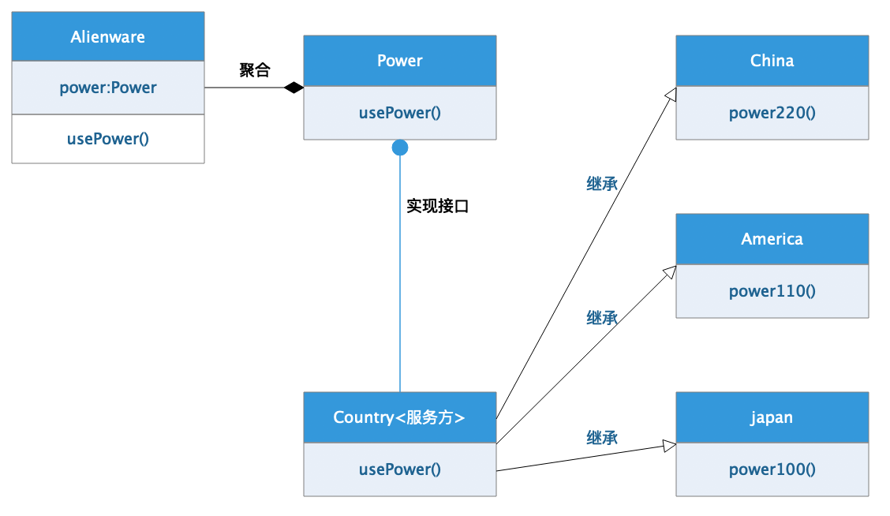

[TOC]

# 1、 `适配器模式`概述

适配器（`Adapter`）[`GOF95`]是一种类型之间互相协作的结构模式，旨在将使用服务的客户方的期望接口，通过适配的适配得到和服务方提供服务的接口相同的实现。

>   注意：很多资料中都是基于服务端来讲解适配器模式的。
>
>   本篇文章中，我们将会带领大家从服务端、客户端两个方面理解什么是适配器，怎么操作适配器。

## 1.1、 什么是适配器模式

|                                                              |                                                              |
| ------------------------------------------------------------ | ------------------------------------------------------------ |
| BGM：大雄最近购买了一个笔记本，打算出国旅游。<br />DX：机器猫，一起出发去国外玩啦，好久没有出去过了呢！ |  |
|  | JQM：好呀好呀，时间不早了，现在就出发吧，带上你用的所有的东西哈，出国了可不比国内。 |
| DX：早就带好啦，不过话说我遇到一个问题，我的笔记本电脑是咱们大天朝电源适配器，去了国外能用吗？ |  |
|  | JQM：这你就OUT了吧，直接跟厂家联系，让给你再发一个X国的笔记本电脑的电源适配器不就好啦。 |
| DX：我知道啊，但是有个小问题，厂家怎么知道X国的电压是多少，它们怎么给我发合适的笔记本电源呢？ |  |
|  | JQM：你个山炮，电源电压就是一种通用规范<br />所有国家都按照自己国家的情况进行实现<br />虽然作为**提供服务的一方**他们每个国家的电压都不一样，但是只要他们满足通用规范就好啦。 |
|  | JQM：而笔记本电脑制作商他们是知道这样的规范的，电脑制作商造出来电脑，要使用电源。所以电脑制作商和你是一边的，相当于使用电压**服务的消费者**，根据通用的规范造出来适合每个国家的电源适配器就好啦呀。 |
| DX：我好想明白了，提供服务的多个国家，每个国家的**电压不同**，但是都是提供了**电压服务**。我自己的笔记本需要电源，只需要我自己用合适的**适配器**来匹配对应国家的电压就可以了。 |  |
|  | JQM：孺子可教也，就是这么个道理。<br />提供服务的一方：<br />  通用规范【电源电压】已经存在。<br />  每个国家~具体【电源电压】已经实现。<br />消费服务的一方：<br />  通用规范【电源电压】已经存在<br />  按照【电源电压】规范找到**合适的适配器**就可以啦。 |
| DX：明白了，**适配器**实现有两种情况：<br />第一种是由服务端实现，也就是每个国家直接给消费者提供好了转换器，这样的话使用服务的消费者得到了便捷，毕竟服务方就那么多，但是消费者千千万。<br />第二种是由消费方实现，服务方提供统一的服务，不同的 消费者根据自己的情况找到适合自己的适配器是使用服务端提供的服务。 |  |
|  | JQM：是的，两种方式通常应用在不同的场合：<br />如果是通用功能，一个公司定义接口规范，多个公司进行具体实现的话，会选择第一种方式，比如`JDBC`的实现就是这样的方式。<br />如果面向服务的模块化项目开发，通常服务端提供的服务接口就会是统一接口，而调用该服务的其他模块需要按照自己的调用方式自己实现适配过程。 |

如图所示：每个电脑产品`Alienware`中都内聚了一个电源`Power`，只需要使用电源供电`usePower()`的方法即可，具体使用的是哪个国家的供电产品，依赖于当前项目中导入的是哪个具体国家的`接口适配器Country`的实现。

下图中服务方式具体的`China`、`America`、`Japan`，适配器`Country`是将服务**适配/转换**为客户端`Alienware`期望的接口`Power`的实现。这就是**适配器模式。**



## 1.2、 适配器模式的优点缺陷

优点：

-   目标类`Power`和适配类`China`进行了解耦合
-   增加了目标类`Power`的通用性，提高了适配类`Country`的复用性
-   增强了程序结构的灵活性和扩展性

缺陷：

-   适配器`Country`和具体适配类`China`，不论是单继承方式或者聚合的方式，耦合度都比较高。


# 2、 `Java`实现

## 2.1、 目标类：`Power`接口

`Power`接口，表示的是上述案例中的电源规范，笔记本电脑需要电源，国家供电的服务就是电源。

```java
package com.damu.inter;

/**
 * <p>项目文档： 电源接口规范 </p>
 *
 * @author <a href="https://github.com/laomu/laomu.github.io">大牧</a>
 * @version V1.0
 */
public interface Power {

    /**
     * 使用电源供电
     */
    void usePower();
}
```

## 2.2、 消费类：`Alienware`类型

`Alienware`电脑是大雄的笔记本，笔记本要附带一个电源，所以将`Power`内聚到了`Alienware`类型中。

```java
package com.damu.consumer;

import com.damu.inter.Power;
import lombok.AllArgsConstructor;
import lombok.Data;
import lombok.experimental.Accessors;

/**
 * <p>项目文档： 外星人电脑 具体产品 </p>
 *
 * @author <a href="https://github.com/laomu/laomu.github.io">大牧</a>
 * @version V1.0
 */
@Data
@Accessors(chain = true)
@AllArgsConstructor
public class Alienware {

    private Power power;

    /**
     * 电脑工作
     */
    public void working() {
        // 电源供电
        power.usePower();
        // 电脑工作
        System.out.println("电脑正在工作中...");
    }
}
```

## 2.3、 服务类：`China/America/Japan`提供电源供电

```java
package com.damu.country;

/**
 * <p>项目文档： 天朝上国</p>
 *
 * @author <a href="https://github.com/laomu/laomu.github.io">大牧</a>
 * @version V1.0
 */
public class China {

    public void power220() {
        System.out.println("天朝上国供电：220V");
    }
}
```

```java
package com.damu.country;

/**
 * <p>项目文档： M国 </p>
 *
 * @author <a href="https://github.com/laomu/laomu.github.io">大牧</a>
 * @version V1.0
 */
public class America {

    public void power110() {
        System.out.println("M国供电电压：110V");
    }
}
```

```java
package com.damu.country;

/**
 * <p>项目文档： 小岛国</p>
 *
 * @author <a href="https://github.com/laomu/laomu.github.io">大牧</a>
 * @version V1.0
 */
public class Japan {

    public void power100() {
        System.out.println("小岛国供电：100V");
    }
}
```


##  2.4、适配器：`ChinaAdapter`适配电脑供电

适配器`ChinaAdapter`就是一个电源的具体实现，所以要实现`Power`接口，同时它要完成供电方法的具体工作，所以通过继承（也可以通过内聚）的方式调用具体供电国家的供电方法，供电方法中实现了方法的转换调用，而这个转换调用，就是具体的适配过程，也是适配器模式的核心思想：**将服务接口转换成客户需要的接口，转换过程就是适配过程**

```java
package com.damu.adapter;

import com.damu.country.China;
import com.damu.inter.Power;

/**
 * <p>项目文档： 天朝适配器 相当于图解中的Country</p>
 *
 * @author <a href="https://github.com/laomu/laomu.github.io">大牧</a>
 * @version V1.0
 */
public class ChinaAdapter extends China implements Power {

    @Override
    public void usePower() {
        // 适配方法中进行调用转换
        super.power220();
    }
}

```

```java
package com.damu.adapter;

import com.damu.country.America;
import com.damu.inter.Power;

/**
 * <p>项目文档： M国适配器 相当于图解中的Country </p>
 *
 * @author <a href="https://github.com/laomu/laomu.github.io">大牧</a>
 * @version V1.0
 */
public class AmericaAdapter extends America implements Power {
    @Override
    public void usePower() {
        // 方法调用适配转换
        super.power110();
    }
}
```

## 2.5、 适配器的使用

```java
package com.damu.main;

import com.damu.adapter.AmericaAdapter;
import com.damu.adapter.ChinaAdapter;
import com.damu.consumer.Alienware;
import com.damu.inter.Power;

/**
 * <p>项目文档： 测试类 </p>
 *
 * @author <a href="https://github.com/laomu/laomu.github.io">大牧</a>
 * @version V1.0
 */
public class Main {

    public static void main(String[] args) {
        // 根据引入的适配器创建对应的适配对象
//        Power power = new ChinaAdapter(); // 大雄在天朝
        Power power = new AmericaAdapter();	// 大雄出国，更换电源适配器

        // 创建电脑对象
        Alienware alienware = new Alienware(power);

        // 电脑接电工作
        alienware.working();
    }
}
```

## 2.6、 小总结

需要注意的是，在`适配器模式`中

-   目标接口`Power`规范了`调用者调用的方法`以及`适配器需要转换后的方法`
    -   调用者`Alienware`和服务提供者`China`之间解耦合

# 3、 `Python`实现

`Python`由于同时支持函数式编程和面向对象的设计，所以实现方式非常多，我们这里模拟`Java`的实现通过类型接口的方式做一版实现

```python
"""
适配器模式
"""
import abc


class Power(metaclass=abc.ABCMeta):
    """电源规范"""

    def power(self):
        raise("该方法必须实现")


class Computer:
    """电脑产品"""

    def __init__(self, power):
        self.power = power

    def working(self):
        # 电源供电
        self.power.power()
        # 电脑工作
        print("扫毒2播放中....")


class China:
    """天朝上国"""

    def power220(self):
        print("220V供电中...")


class ChinaAdapter(China, Power):
    """适配器类型"""

    def __init__(self, *args, **kwargs):
        super(ChinaAdapter, self).__init__(*args, **kwargs)

    def power(self):
        """供电方法"""
        # 调用国家供电方法
        super(ChinaAdapter, self).power220()

# 其他国家供电 及 适配类型 这里不多写了


if __name__ == "__main__":
    # 创建适配器
    power = ChinaAdapter()
    # 创建电脑
    computer = Computer(power)
    # 电脑工作
    computer.working()
```


# 4、 `Go`实现

`Go`中的接口的实现和继承关系，都是通过结构体内聚来完成的，`适配器模式`代码如下：

```go
package main

import "fmt"

/*电源接口规范*/
type Power interface{
	PowerSupply()
}

/*电脑产品*/
type ComputerHuawei struct{
	Power
	name string
}

func (computer ComputerHuawei) Working()  {
	computer.PowerSupply()
	fmt.Println("电源正常供电，电脑开始工作")
}

/*国家供电*/
type China struct {
	name string
}

func (china China) Power220()  {
	fmt.Print("天朝上国，220V供电中.")
}

/* 适配器*/
type ChinaAdapter struct {
	China
	Power
}

func (chinaAdapter ChinaAdapter) PowerSupply() {
	// 调用国家供电
	chinaAdapter.Power220()
}

func main()  {
	// 创建适配器
	china := China{name:"中国"}
	adpater := ChinaAdapter{}
	adpater.China = china

	// 创建电脑
	computer := ComputerHuawei{name:"华为游戏本"}
	// 内聚电源适配器
	computer.Power = adpater
	// 正常工作
	computer.Working()
}
```

